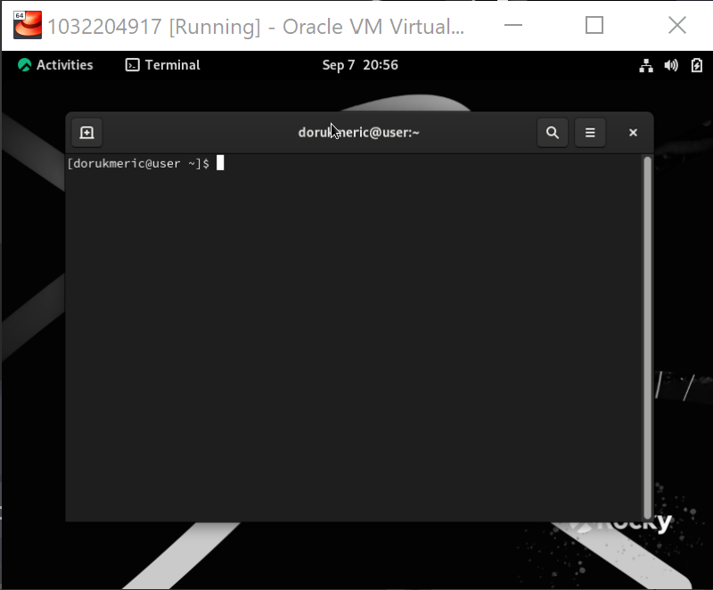

---
## Front matter
lang: ru-RU
title: Информационная безопасность
subtitle: Презентация к лабораторной работе № 1
author:
  - Мерич Дорук Каймакджыоглу.
institute:
  - Российский университет дружбы народов, Москва, Россия
date: 08/09/2023

## i18n babel
babel-lang: russian
babel-otherlangs: english

## Formatting pdf
toc: false
toc-title: Содержание
slide_level: 2
aspectratio: 169
section-titles: true
theme: metropolis
header-includes:
 - \metroset{progressbar=frametitle,sectionpage=progressbar,numbering=fraction}
 - '\makeatletter'
 - '\beamer@ignorenonframefalse'
 - '\makeatother'
---

# Информация

## Докладчик

:::::::::::::: {.columns align=center}
::: {.column width="70%"}

  * Мерич Дорук Каймакджыоглу
  * Студент
  * НКНбд-01-20
  * Российский университет дружбы народов
  * 1032204917
  * <https://github.com/dorukme123>

:::
::: {.column width="30%"}

:::
::::::::::::::

## Актуальность

{#fig:000 width=70%}

Rocky Linux -- это свободная и открытая операционная система Linux, разработанная как альтернатива CentOS Linux после того, как CentOS Linux перестал быть стабильным и надежным клона Red Hat Enterprise Linux (RHEL). Rocky Linux разрабатывается сообществом и ориентирован на предоставление стабильной и долгосрочной поддержки для предприятий и организаций.

## Объект и предмет исследования

- выполнил действия, показанные в отчете.
{#fig:001 width=70%}

## Цели и задачи

- Целью данной работы является приобретение практических навыков установки операционной системы на виртуальную машину, настройки ми- нимально необходимых для дальнейшей работы сервисов.     

## Материалы и методы

- LaTex    
- Процессор **pandoc** для входного формата Markdown    
- Результирующие форматы    
	- **pdf**    
	- **docx**     
- Автоматизация процесса создания: **Makefile**       

## Результаты

- установил операционную систему, как показано в отчете, затем использовал некоторые команды, чтобы узнать больше информации о нашей машине.
  

## Итог работы

- Получено **pdf**      
- Получено **docx**     
- Получено **html** 