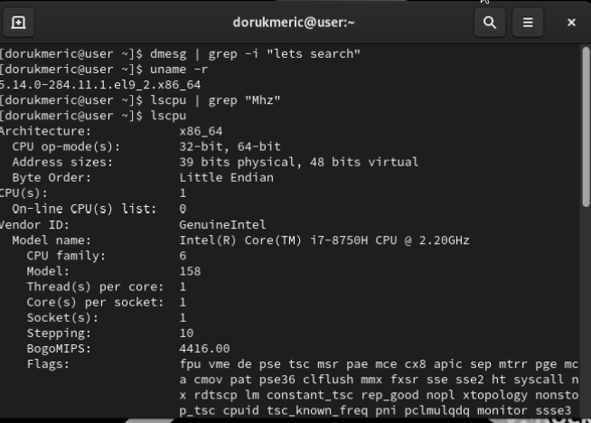

---
## Front matter
title: "Шаблон отчёта по лабораторной работе"
subtitle: "Лабораторная работа № 1"
author: "Мерич Дорук Каймакджыоглу"

## Generic otions
lang: ru-RU
toc-title: "Содержание"

## Bibliography
bibliography: bib/cite.bib
csl: pandoc/csl/gost-r-7-0-5-2008-numeric.csl

## Pdf output format
toc: true # Table of contents
toc-depth: 2
lof: true # List of figures
lot: true # List of tables
fontsize: 12pt
linestretch: 1.5
papersize: a4
documentclass: scrreprt
## I18n polyglossia
polyglossia-lang:
  name: russian
polyglossia-otherlangs:
  name: english
## I18n babel
babel-lang: russian
babel-otherlangs: english
## Fonts
mainfont: PT Serif
romanfont: PT Serif
sansfont: PT Sans
monofont: PT Mono
mainfontoptions: Ligatures=TeX
romanfontoptions: Ligatures=TeX
sansfontoptions: Ligatures=TeX,Scale=MatchLowercase
monofontoptions: Scale=MatchLowercase,Scale=0.9
## Biblatex
biblatex: true
biblio-style: "gost-numeric"
biblatexoptions:
  - parentracker=true
  - backend=biber
  - hyperref=auto
  - language=auto
  - autolang=other*
  - citestyle=gost-numeric
## Pandoc-crossref LaTeX customization
figureTitle: "Рис."
tableTitle: "Таблица"
listingTitle: "Листинг"
lofTitle: "Список иллюстраций"
lotTitle: "Список таблиц"
lolTitle: "Листинги"
## Misc options
indent: true
header-includes:
  - \usepackage{indentfirst}
  - \usepackage{float} # keep figures where there are in the text
  - \floatplacement{figure}{H} # keep figures where there are in the text
---

# Цель работы
Целью данной работы является приобретение практических навыков установки операционной системы на виртуальную машину, настройки минимально необходимых для дальнейшей работы сервисов.


# Задание
установить linux-машину RockyOS и используйте команды для поиска информации.


# Теоретическое введение
{#fig:000 width=70%}

Rocky Linux -- это свободная и открытая операционная система Linux, разработанная как альтернатива CentOS Linux после того, как CentOS Linux перестал быть стабильным и надежным клона Red Hat Enterprise Linux (RHEL). Rocky Linux разрабатывается сообществом и ориентирован на предоставление стабильной и долгосрочной поддержки для предприятий и организаций.


# Выполнение лабораторной работы

1. Установка ROCKYLINUX на виртуальную машину.
{#fig:001 width=70%}

2. Oткрытие операционной системы для дальнейшей инициализации.
{#fig:002 width=70%}

3. Все настройки выполнены, и начинается установка.
{#fig:003 width=70%}
{#fig:004 width=70%}

4. Настроил имя пользователя и получил доступ к операционной системе.

{#fig:005 width=70%}
{#fig:006 width=70%}

5. Версия ядра Linux (Linux version)/астота процессора (Detected Mhz processor)/Модель процессора (CPU0).
{#fig:007 width=70%}
6. Объем доступной оперативной памяти (Memory available).
{#fig:008 width=70%}
7. Тип обнаруженного гипервизора (Hypervisor detected).
{#fig:009 width=70%}
8. Тип файловой системы корневого раздела.
{#fig:010 width=70%}
9. Последовательность монтирования файловых систем.<br>```cat /etc/fstab```
# Контрольные вопросы
1. Какую информацию содержит учётная запись пользователя? 
**Имя пользователя (Username) / User ID (UID) / Group ID (GID) / Домашний каталог (Home Directory) / Оболочка (Shell)**
2. Укажите команды терминала и приведите примеры:
– для получения справки по команде; **man команда**
– для перемещения по файловой системе; **cd путь_к_каталогу**
– для просмотра содержимого каталога; **ls /var/log**
– для определения объёма каталога; **du -sh путь_к_каталогу**
– для создания / удаления каталогов / файлов; **mkdir название_каталога / touch имя_файла / rm -r название_каталога**
– для задания определённых прав на файл / каталог; **chmod права_доступа файл_или_каталог**
– для просмотра истории команд. **history**
3. Что такое файловая система? Приведите примеры с краткой характери-
стикой.
**Файловая система - это способ организации и хранения данных на компьютере или в хранилище. Она определяет структуру, формат и способы доступа к файлам и каталогам. Файловые системы позволяют пользователям создавать, хранить, организовывать и управлять файлами и данными.**
4. Как посмотреть, какие файловые системы подмонтированы в ОС?
**df -T /**
5. Как удалить зависший процесс? **команду kill**

# Выводы

установил операционную систему, как показано в отчете, затем использовал некоторые команды, чтобы узнать больше информации о нашей машине.

# Список литературы{.unnumbered}

[rockylinux](https://rockylinux.org/) {#refs:rockylinux}