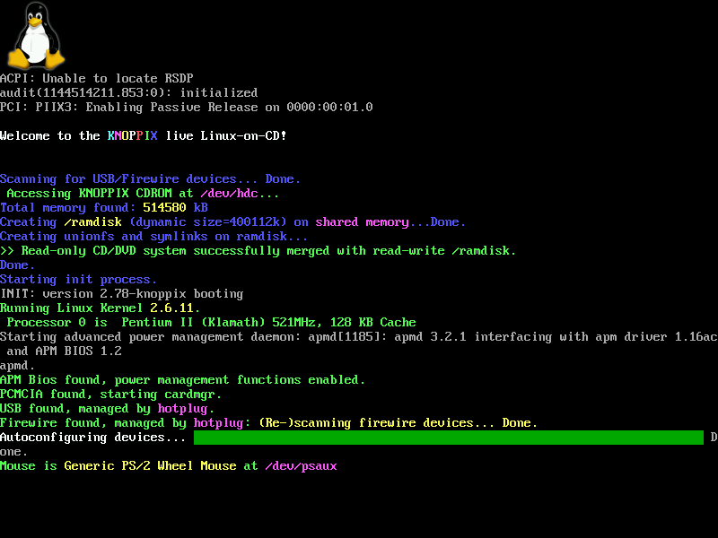
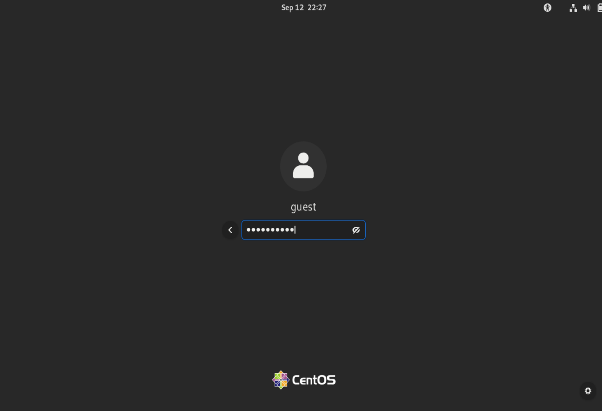
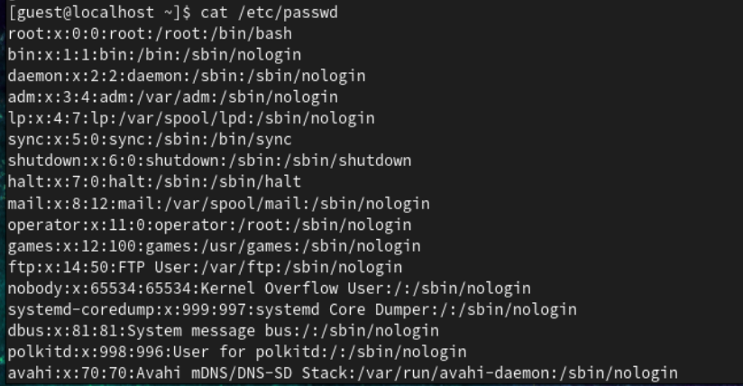

---
## Front matter
lang: ru-RU
title: Информационная безопасность
subtitle: Презентация к лабораторной работе № 2
author:
  - Мерич Дорук Каймакджыоглу.
institute:
  - Российский университет дружбы народов, Москва, Россия
date: 12/09/2023

## i18n babel
babel-lang: russian
babel-otherlangs: english

## Formatting pdf
toc: false
toc-title: Содержание
slide_level: 2
aspectratio: 169
section-titles: true
theme: metropolis
header-includes:
 - \metroset{progressbar=frametitle,sectionpage=progressbar,numbering=fraction}
 - '\makeatletter'
 - '\beamer@ignorenonframefalse'
 - '\makeatother'
---

# Информация

## Докладчик

:::::::::::::: {.columns align=center}
::: {.column width="70%"}

  * Мерич Дорук Каймакджыоглу
  * Студент
  * НКНбд-01-20
  * Российский университет дружбы народов
  * 1032204917
  * <https://github.com/dorukme123>

:::
::: {.column width="30%"}

:::
::::::::::::::

## Актуальность

{#fig:000 width=70%}
- Консоль Linux - это системная консоль, встроенная в ядро Linux. Системная консоль - это устройство, которое получает все сообщения и предупреждения ядра и которое позволяет входить в систему в однопользовательском режиме. Консоль Linux предоставляет ядру и другим процессам возможность отправлять текстовый вывод пользователю и получать текстовый ввод от пользователя. Обычно пользователь вводит текст с помощью компьютерной клавиатуры и считывает выводимый текст на мониторе компьютера. Ядро Linux поддерживает виртуальные консоли – консоли, которые логически разделены, но которые имеют доступ к одной и той же физической клавиатуре и дисплею. Консоль Linux (и виртуальные консоли Linux) реализованы подсистемой VT (виртуальный терминал) ядра Linux и не зависят от какого-либо программного обеспечения пользовательского пространства. Это в отличие от эмулятора терминала, который представляет собой процесс пользовательского пространства, эмулирующий терминал, и обычно используется в среде графического отображения.

## Объект и предмет исследования

- Постараться последовательно выполнить все пункты, занося ваши ответы на поставленные вопросы и замечания в отчёт.
- Получение практических навыков работы в консоли с атрибутами файлов, закрепление теоретических основ дискреционного разграничения доступа в современных системах с открытым кодом на базе ОС Linux1.
{#fig:001 width=70%}

## Цели и задачи

- чтобы разобраться в разрешениях системы Linux, ознакомьтесь с разрешениями в гостевой среде и проверьте свои знания после прохождения всех примеров.   
{#fig:002 width=70%}

## Материалы и методы

- Centos
- LaTex    
- Процессор **pandoc** для входного формата Markdown    
- Результирующие форматы    
	- **pdf**    
	- **docx**     
- Автоматизация процесса создания: **Makefile**       

## Результаты

Получил практические навыки работы с консолью с атрибутами файлов, закрепляющие теоретические основы дискреционного разграничения доступа в современных системах с открытым исходным кодом.
  
## Итог работы

- Получено **pdf**  из report.md   
- Получено **docx**  из report.md   
- Получено **html** из presentation.md
- Получено **pdf** из presentation.md
- Получено **docx** из presentation.md
- Запись отчета выложен в youtube.com
- Запись презентация выложен в youtube.com
- Запись отчета выложен в rutube.com
- Запись презентация выложен в rutube.com
- Работа выложена в респоситории в github.com
- CHANGELOG.md создано
- Версия на работе создано