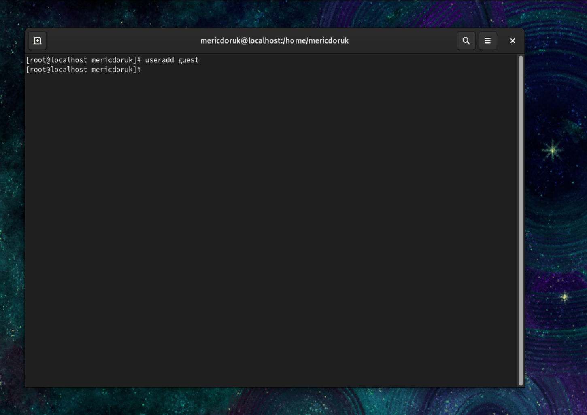

<<<<<<< HEAD
---
## Front matter
lang: ru-RU
title: Математическое моделирование
subtitle: Презентация к лабораторной работе № 2
author:
  - .
institute:
  - Российский университет дружбы народов, Москва, Россия
date: 18/02/2023

## i18n babel
babel-lang: russian
babel-otherlangs: english

## Formatting pdf
toc: false
toc-title: Содержание
slide_level: 2
aspectratio: 169
section-titles: true
theme: metropolis
header-includes:
 - \metroset{progressbar=frametitle,sectionpage=progressbar,numbering=fraction}
 - '\makeatletter'
 - '\beamer@ignorenonframefalse'
 - '\makeatother'
---

# Информация

## Докладчик

:::::::::::::: {.columns align=center}
::: {.column width="70%"}

  * 
  * Студент
  * 
  * Российский университет дружбы народов
  * 
  * 

:::
::: {.column width="30%"}

:::
::::::::::::::

## Актуальность

- решение математических моделей поиска на языке программирования julia

## Объект и предмет исследования

- язык программирования julia и его атрибуты   
- поисковое моделирование в математическом моделировании

## Цели и задачи

<h2>Вариант 38</h2>

На море в тумане катер береговой охраны преследует лодку браконьеров.
Через определенный промежуток времени туман рассеивается, и лодка
обнаруживается на расстоянии <b>19</b> км от катера. Затем лодка снова скрывается в
тумане и уходит прямолинейно в неизвестном направлении. Известно, что скорость
катера в <b>5,1</b> раза больше скорости браконьерской лодки.

<ul>
    <li>1. Запишите уравнение, описывающее движение катера, с начальными
условиями для двух случаев (в зависимости от расположения катера
относительно лодки в начальный момент времени).</li>
    <li>2. Постройте траекторию движения катера и лодки для двух случаев.</li>
    <li>3. Найдите точку пересечения траектории катера и лодки</li>
</ul>

- пойми проблему и следуй инструкциям    
- решай приведенные уравнения, чтобы найти полярные координаты    
- реализуйте и постройте решение, запрограммировав его на julia       

## Материалы и методы

- julia
  - julia console
- jupyter notebook
  - jupyter notebook ide for julia
- LaTex    
- Процессор **pandoc** для входного формата Markdown    
- Результирующие форматы    
	- **pdf**    
	- **docx**     
- Автоматизация процесса создания: **Makefile**       

## Результаты

- Создан отчет для лабораторной работы
- Создана презентация для лабораторной работы
- решена задача математического моделирования

## Итог работы

- Получено **pdf**      
- Получено **docx**     
=======
---
## Front matter
lang: ru-RU
title: Математическое моделирование
subtitle: Презентация к лабораторной работе № 2
author:
  - Мерич Дорук Каймакджыоглу.
institute:
  - Российский университет дружбы народов, Москва, Россия
date: 18/02/2023

## i18n babel
babel-lang: russian
babel-otherlangs: english

## Formatting pdf
toc: false
toc-title: Содержание
slide_level: 2
aspectratio: 169
section-titles: true
theme: metropolis
header-includes:
 - \metroset{progressbar=frametitle,sectionpage=progressbar,numbering=fraction}
 - '\makeatletter'
 - '\beamer@ignorenonframefalse'
 - '\makeatother'
---

# Информация

## Докладчик

:::::::::::::: {.columns align=center}
::: {.column width="70%"}

  * Мерич Дорук Каймакджыоглу
  * Студент
  * НКНбд-01-20
  * Российский университет дружбы народов
  * 1032204917
  * <https://github.com/dorukme123>

:::
::: {.column width="30%"}

:::
::::::::::::::

## Актуальность

- решение математических моделей поиска на языке программирования julia

## Объект и предмет исследования

- язык программирования julia и его атрибуты   
- поисковое моделирование в математическом моделировании

## Цели и задачи

<h2>Вариант 38</h2>

На море в тумане катер береговой охраны преследует лодку браконьеров.
Через определенный промежуток времени туман рассеивается, и лодка
обнаруживается на расстоянии <b>19</b> км от катера. Затем лодка снова скрывается в
тумане и уходит прямолинейно в неизвестном направлении. Известно, что скорость
катера в <b>5,1</b> раза больше скорости браконьерской лодки.

<ul>
    <li>1. Запишите уравнение, описывающее движение катера, с начальными
условиями для двух случаев (в зависимости от расположения катера
относительно лодки в начальный момент времени).</li>
    <li>2. Постройте траекторию движения катера и лодки для двух случаев.</li>
    <li>3. Найдите точку пересечения траектории катера и лодки</li>
</ul>

- пойми проблему и следуй инструкциям    
- решай приведенные уравнения, чтобы найти полярные координаты    
- реализуйте и постройте решение, запрограммировав его на julia       

## Материалы и методы

- julia
  - julia console
- jupyter notebook
  - jupyter notebook ide for julia
- LaTex    
- Процессор **pandoc** для входного формата Markdown    
- Результирующие форматы    
	- **pdf**    
	- **docx**     
- Автоматизация процесса создания: **Makefile**       

## Результаты

- Создан отчет для лабораторной работы
- Создана презентация для лабораторной работы
- решена задача математического моделирования

## Итог работы

- Получено **pdf**      
- Получено **docx**     
>>>>>>> 6d49208fd643884b34583949b2f817620f39c651
