---
## Front matter
title: "Шаблон отчёта по лабораторной работе"
subtitle: "Лабораторная работа № 2"
author: "Мерич Дорук Каймакджыоглу"

## Generic otions
lang: ru-RU
toc-title: "Содержание"

## Bibliography
bibliography: bib/cite.bib
csl: pandoc/csl/gost-r-7-0-5-2008-numeric.csl

## Pdf output format
toc: true # Table of contents
toc-depth: 2
lof: true # List of figures
lot: true # List of tables
fontsize: 12pt
linestretch: 1.5
papersize: a4
documentclass: scrreprt
## I18n polyglossia
polyglossia-lang:
  name: russian
polyglossia-otherlangs:
  name: english
## I18n babel
babel-lang: russian
babel-otherlangs: english
## Fonts
mainfont: PT Serif
romanfont: PT Serif
sansfont: PT Sans
monofont: PT Mono
mainfontoptions: Ligatures=TeX
romanfontoptions: Ligatures=TeX
sansfontoptions: Ligatures=TeX,Scale=MatchLowercase
monofontoptions: Scale=MatchLowercase,Scale=0.9
## Biblatex
biblatex: true
biblio-style: "gost-numeric"
biblatexoptions:
  - parentracker=true
  - backend=biber
  - hyperref=auto
  - language=auto
  - autolang=other*
  - citestyle=gost-numeric
## Pandoc-crossref LaTeX customization
figureTitle: "Рис."
tableTitle: "Таблица"
listingTitle: "Листинг"
lofTitle: "Список иллюстраций"
lotTitle: "Список таблиц"
lolTitle: "Листинги"
## Misc options
indent: true
header-includes:
  - \usepackage{indentfirst}
  - \usepackage{float} # keep figures where there are in the text
  - \floatplacement{figure}{H} # keep figures where there are in the text
---

# Цель работы

Получение практических навыков работы в консоли с атрибутами файлов, закрепление теоретических основ дискреционного разграничения доступа в современных системах с открытым кодом на базе ОС Linux1.

# Задание

Постараться последовательно выполнить все пункты, занося ваши ответы на поставленные вопросы и замечания в отчёт.

# Теоретическое введение
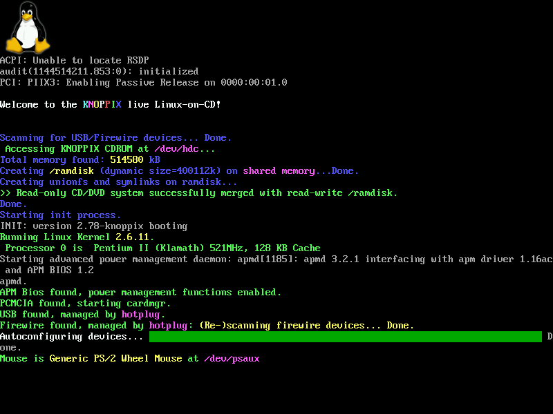{#fig:000 width=70%}
Консоль Linux - это системная консоль, встроенная в ядро Linux. Системная консоль - это устройство, которое получает все сообщения и предупреждения ядра и которое позволяет входить в систему в однопользовательском режиме. Консоль Linux предоставляет ядру и другим процессам возможность отправлять текстовый вывод пользователю и получать текстовый ввод от пользователя. Обычно пользователь вводит текст с помощью компьютерной клавиатуры и считывает выводимый текст на мониторе компьютера. Ядро Linux поддерживает виртуальные консоли – консоли, которые логически разделены, но которые имеют доступ к одной и той же физической клавиатуре и дисплею. Консоль Linux (и виртуальные консоли Linux) реализованы подсистемой VT (виртуальный терминал) ядра Linux и не зависят от какого-либо программного обеспечения пользовательского пространства. Это в отличие от эмулятора терминала, который представляет собой процесс пользовательского пространства, эмулирующий терминал, и обычно используется в среде графического отображения.

# Выполнение лабораторной работы

1. В установленной при выполнении предыдущей лабораторной работы
операционной системе создайте учётную запись пользователя guest (использую учётную запись администратора):
useradd guest
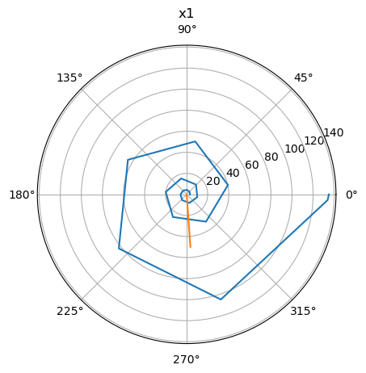{#fig:001 width=70%}

2. Задайте пароль для пользователя guest (использую учётную запись администратора):
passwd guest
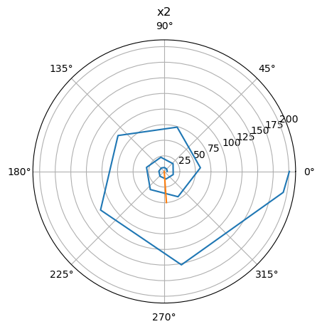{#fig:002 width=70%}

3. Войдите в систему от имени пользователя guest.
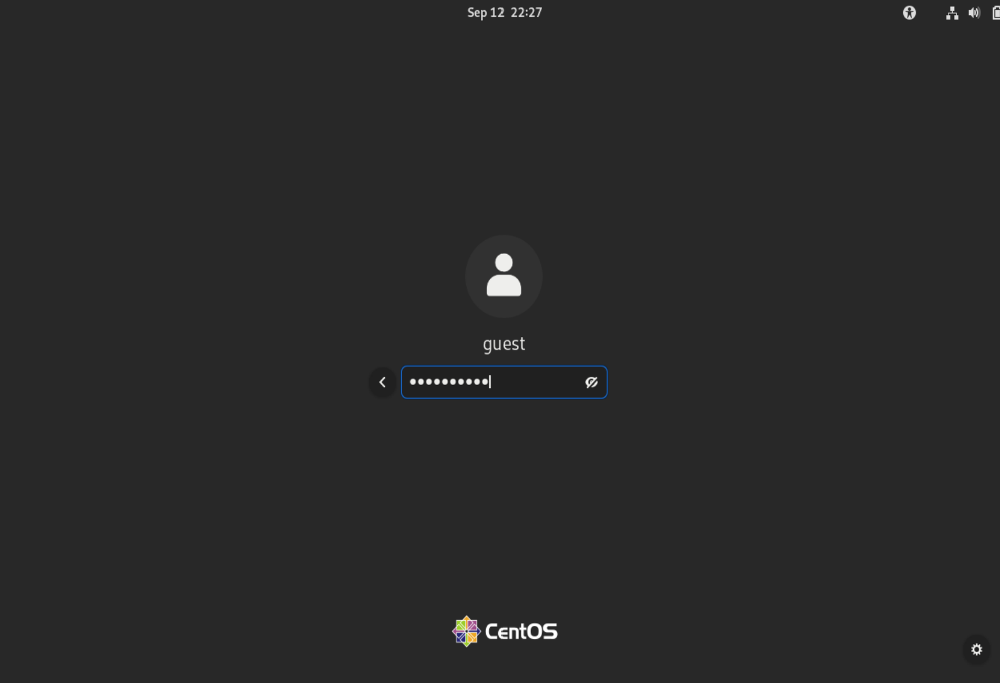{#fig:003 width=70%}

4. Определите директорию, в которой вы находитесь, командой pwd. Сравните её с приглашением командной строки. Определите, является ли она вашей домашней директорией? Если нет, зайдите в домашнюю директорию.
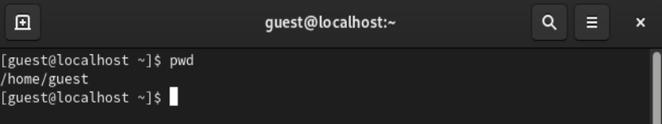{#fig:004 width=70%}

5. Уточните имя вашего пользователя командой whoami.
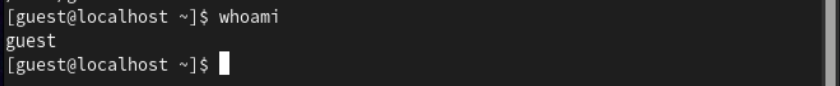{#fig:005 width=70%}

6. Уточните имя вашего пользователя, его группу, а также группы, куда входит пользователь, командой id. Выведенные значения uid, gid и др. запомните. Сравните вывод id с выводом команды groups.
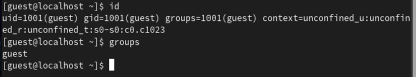{#fig:006 width=70%}

7. Сравните полученную информацию об имени пользователя с данными,
выводимыми в приглашении командной строки.
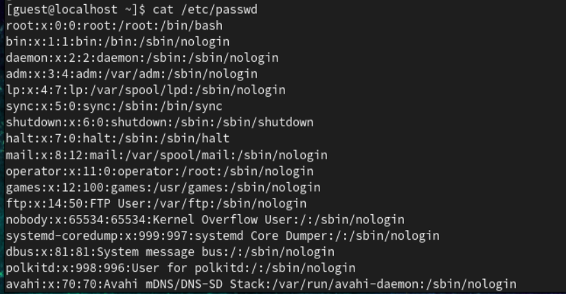{#fig:007 width=70%}

8. Просмотрите файл /etc/passwd командой
cat /etc/passwd
Найдите в нём свою учётную запись. Определите uid пользователя.
Определите gid пользователя. Сравните найденные значения с полученными в предыдущих пунктах.
Замечание: в случае, когда вывод команды не умещается на одном
экране монитора, используйте прокрутку вверх–вниз (удерживая клавишу shift, нажимайте page up и page down) либо программу grep в качестве фильтра для вывода только строк, содержащих определённые
буквенные сочетания:
cat /etc/passwd | grep guest
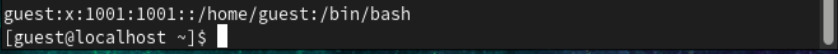{#fig:008 width=70%}

9. Определите существующие в системе директории командой
ls -l /home/ 
Удалось ли вам получить список поддиректорий директории /home? Какие права установлены на директориях?
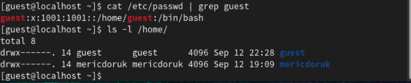{#fig:009 width=70%}

10. Проверьте, какие расширенные атрибуты установлены на поддиректориях, находящихся в директории /home, командой:
lsattr /home
Удалось ли вам увидеть расширенные атрибуты директории?
Удалось ли вам увидеть расширенные атрибуты директорий других
пользователей?
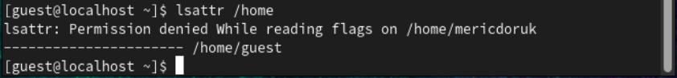{#fig:010 width=70%}

11. Создайте в домашней директории поддиректорию dir1 командой
mkdir dir1
Определите командами ls -l и lsattr, какие права доступа и расши-
ренные атрибуты были выставлены на директорию dir1.
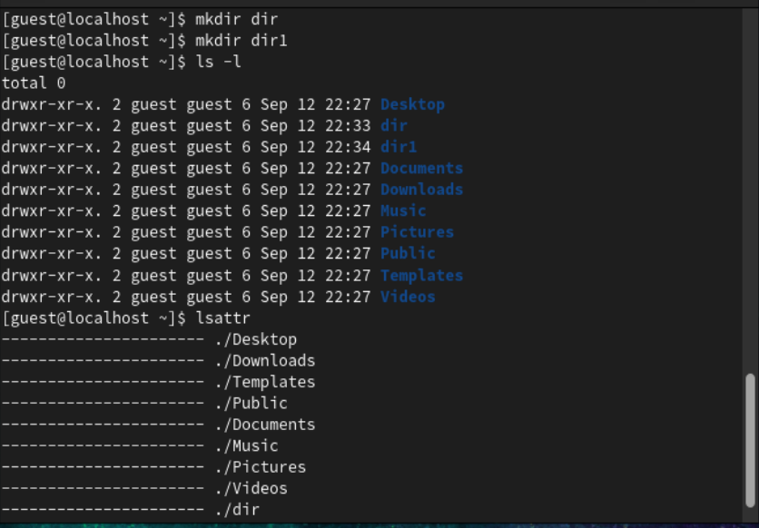{#fig:011 width=70%}

12. Снимите с директории dir1 все атрибуты командой
chmod 000 dir1
и проверьте с её помощью правильность выполнения команды
ls -l
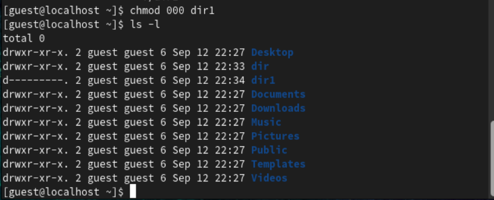{#fig:012 width=70%}

13. Попытайтесь создать в директории dir1 файл file1 командой
echo "test" > /home/guest/dir1/file1
Объясните, почему вы получили отказ в выполнении операции по созданию файла?
Оцените, как сообщение об ошибке отразилось на создании файла? Проверьте командой
ls -l /home/guest/dir1
действительно ли файл file1 не находится внутри директории dir1.
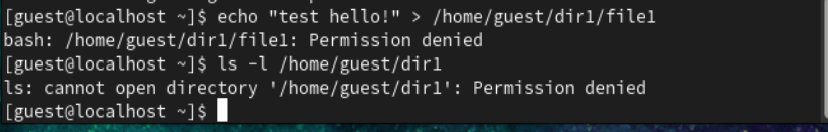{#fig:013 width=70%}

14. Заполните таблицу «Установленные права и разрешённые действия»
(см. табл. 2.1), выполняя действия от имени владельца директории (файлов), определив опытным путём, какие операции разрешены, а какие нет.
Если операция разрешена, занесите в таблицу знак «+», если не разрешена, знак «-».
**Замечание 1:** при заполнении табл. 2.1 рассматриваются не все атрибуты файлов и директорий, а лишь «первые три»: г, w, х, для «владельца».
Остальные атрибуты также важны (особенно при использовании досту-
па от имени разных пользователей, входящих в те или иные группы).
Проверка всех атрибутов при всех условиях значительно увеличила бы
таблицу: так 9 атрибутов на директорию и 9 атрибутов на файл дают
218 строк без учёта дополнительных атрибутов, плюс таблица была бы
расширена по количеству столбцов, так как все приведённые операции
необходимо было бы повторить ещё как минимум для двух пользовате-
лей: входящего в группу владельца файла и не входящего в неё.
После полного заполнения табл. 2.1 и анализа полученных данных нам
удалось бы выяснить, что заполнение её в таком виде излишне. Можно разделить большую таблицу на несколько малых независимых таблиц.
В данном примере предлагается рассмотреть 3 + 3 атрибута, т.е. 26 = 64
варианта.
**Замечание 2:** в ряде действий при выполнении команды удаления файла
вы можете столкнуться с вопросом: «удалить защищённый от записи пустой обычный файл dir1/file1?» Обратите внимание, что наличие этого вопроса не позволяет сделать правильный вывод о том, что файл можно удалить. В ряде случаев, при ответе «y» (да) на указанный вопрос, возможно получить другое сообщение: «невозможно удалить dirl /file1: Отказано в доступе».
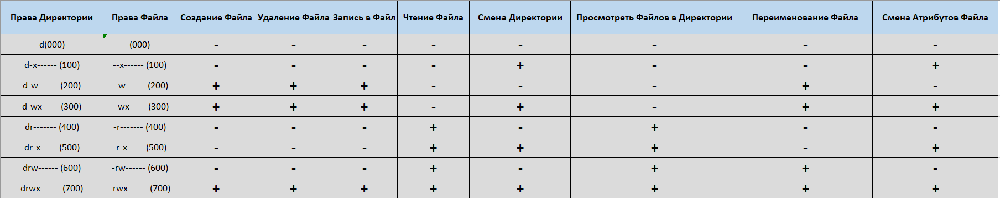{#fig:014 width=70%}

15. На основании заполненной таблицы определите те или иные минимально необходимые права для выполнения операций внутри директории dir1, заполните табл. 2.2
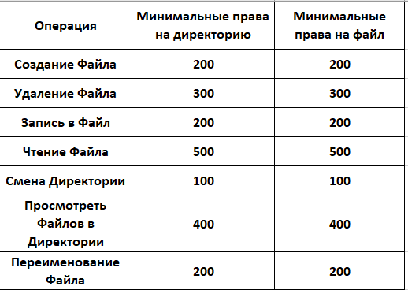{#fig:015 width=70%}

# Выводы

Получил практические навыки работы с консолью с атрибутами файлов, закрепляющие теоретические основы дискреционного разграничения доступа в современных системах с открытым исходным кодом.

# Список литературы{.unnumbered}

[linux](https://en.wikipedia.org/wiki/Linux_console) {#refs:linux}

[Лабораторная работа № 2. Дискреционное
разграничение прав в Linux. Основные
атрибуты](https://esystem.rudn.ru/pluginfile.php/2090202/mod_resource/content/6/002-lab_discret_attr.pdf) {#refs:lab02}