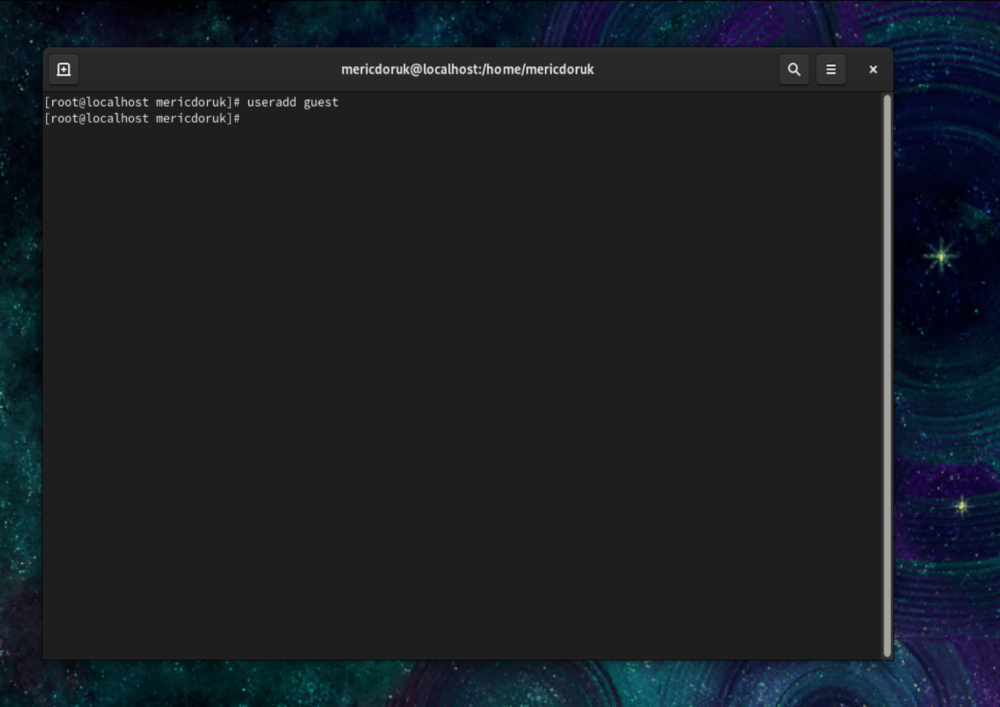
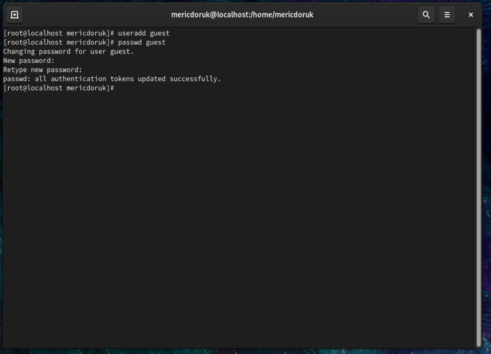

<<<<<<< HEAD
---
## Front matter
title: "Шаблон отчёта по лабораторной работе"
subtitle: "Лабораторная работа № 2"
author: ""

## Generic otions
lang: ru-RU
toc-title: "Содержание"

## Bibliography
bibliography: bib/cite.bib
csl: pandoc/csl/gost-r-7-0-5-2008-numeric.csl

## Pdf output format
toc: true # Table of contents
toc-depth: 2
lof: true # List of figures
lot: true # List of tables
fontsize: 12pt
linestretch: 1.5
papersize: a4
documentclass: scrreprt
## I18n polyglossia
polyglossia-lang:
  name: russian
  options:
	- spelling=modern
	- babelshorthands=true
polyglossia-otherlangs:
  name: english
## I18n babel
babel-lang: russian
babel-otherlangs: english
## Fonts
mainfont: PT Serif
romanfont: PT Serif
sansfont: PT Sans
monofont: PT Mono
mainfontoptions: Ligatures=TeX
romanfontoptions: Ligatures=TeX
sansfontoptions: Ligatures=TeX,Scale=MatchLowercase
monofontoptions: Scale=MatchLowercase,Scale=0.9
## Biblatex
biblatex: true
biblio-style: "gost-numeric"
biblatexoptions:
  - parentracker=true
  - backend=biber
  - hyperref=auto
  - language=auto
  - autolang=other*
  - citestyle=gost-numeric
## Pandoc-crossref LaTeX customization
figureTitle: "Рис."
tableTitle: "Таблица"
listingTitle: "Листинг"
lofTitle: "Список иллюстраций"
lotTitle: "Список таблиц"
lolTitle: "Листинги"
## Misc options
indent: true
header-includes:
  - \usepackage{indentfirst}
  - \usepackage{float} # keep figures where there are in the text
  - \floatplacement{figure}{H} # keep figures where there are in the text
---

# Цель работы
построение математических моделей для
выбора правильной стратегии при решении поисковых задач.

# Теоретическое введение

**Julia** - это высокоуровневый динамический язык программирования. Его функции хорошо подходят для численного анализа и вычислительной науки. Отличительные аспекты дизайна Джулии включают систему типов с параметрическим полиморфизмом на динамическом языке программирования; с множественной отправкой в качестве основной парадигмы программирования.

# Выполнение лабораторной работы
```
a = (1032204917 % 70) + 1
println("Вариант ", a)

```

    Вариант 38
    

<h2>Вариант 38</h2>
<p>На море в тумане катер береговой охраны преследует лодку браконьеров.
Через определенный промежуток времени туман рассеивается, и лодка
обнаруживается на расстоянии <b>19</b> км от катера. Затем лодка снова скрывается в
тумане и уходит прямолинейно в неизвестном направлении. Известно, что скорость
катера в <b>5,1</b> раза больше скорости браконьерской лодки.</p>
<ul>
    <li>1. Запишите уравнение, описывающее движение катера, с начальными
условиями для двух случаев (в зависимости от расположения катера
относительно лодки в начальный момент времени).</li>
    <li>2. Постройте траекторию движения катера и лодки для двух случаев.</li>
    <li>3. Найдите точку пересечения траектории катера и лодки</li>
</ul>


##Постановка задачи

<p> t<sub>0</sub> = 0 , x<sub>л0</sub> = 0 место нахождения лодки браконьеров в
момент обнаружения, x<sub>k0</sub> = 19
- место нахождения катера береговой охраны
относительно лодки браконьеров в момент обнаружения лодки.</p>

<p>Введем полярные координаты. Считаем, что полюс - это точка обнаружения лодки браконьеров x<sub>л0</sub>( = x<sub>л0</sub>=0)  а полярная ось **r** проходит через точку нахождения катера береговой охраны</p>

<p>Траектория катера должна быть такой, чтобы и катер, и лодка все время
были на одном расстоянии от полюса $$\theta$$, только в этом случае траектория
катера пересечется с траекторией лодки.
Поэтому для начала катер береговой охраны должен двигаться некоторое
время прямолинейно, пока не окажется на том же расстоянии от полюса, что
и лодка браконьеров. После этого катер береговой охраны должен двигаться
вокруг полюса удаляясь от него с той же скоростью, что и лодка
браконьеров.</p>

<p>Чтобы найти расстояние x (расстояние после которого катер начнет двигаться вокруг полюса), необходимо составить простое уравнение. Пусть через время t катер и лодка окажутся на одном расстоянии x от полюса. За это время лодка пройдет x , а катер k - x  или k + x , в зависимости от начального положения катера относительно полюса). Время, за которое они пройдут это расстояние, вычисляется как x / v или k - x / 2v (во втором случае x + k / 2v ). Так как время одно и то же, то эти величины одинаковы. Тогда неизвестное расстояние x можно найти из следующего уравнения:
$$ \frac{x}{v} = \frac{19 - x}{5.1v}$$ в первом случае или
$$ \frac{x}{v} = \frac{19 + x}{5.1v}$$ 
Отсюда мы найдем два значения $$ x_1 = \frac{190}{61} , x_2 = \frac{190}{41} $$
</p>

<p>После того, как катер береговой охраны окажется на одном расстоянии от полюса, что и лодка, он должен сменить прямолинейную траекторию и начать двигаться вокруг полюса удаляясь от него со скоростью лодки v . $$ v_r = \sqrt{26.01v^2-v^2} = \sqrt{25.01}v$$</p>

<p>Решение исходной задачи сводится к решению системы из двух
дифференциальных уравнений:
$$
\begin{equation} \label{eq1}
 \begin{split}
  \frac{dr}{dv} = v \\
  r\frac{d\theta}{dt} = \sqrt{25.01}v 
  \end{split}
\end{equation}
$$
с начальными условиями
$$
\begin{equation} \label{eq2}
 \begin{split}
  \theta_0 = 0 
  \\
   r_0 = \frac{190}{61} 
  \end{split}
\end{equation}
$$
или
$$
\begin{equation} \label{eq3}
 \begin{split}
  \theta_0 = 6\pi 
  \\
   r_0 = \frac{190}{41} 
  \end{split}
\end{equation}
$$    
</p>

мы начинаем с внедрения необходимых библиотек


```
using PyPlot;
using DifferentialEquations;
```


```
const A = (0, 6π)

const x1 = 190/61
const x2 = 190/41

function vg(u, p, A)
return u/√(25.01)
end

eq1 = ODEProblem(vg, x1, A)
s1 = solve(eq1,abstol=1e-8,reltol=1e-8)

eq2 = ODEProblem(vg, x2, A)
s2 = solve(eq2,abstol=1e-8,reltol=1e-8)

polar(s1.t, s1.u)
plot(fill(-1.5, 6), collect(0:10:50))
title("x1")


```


    

    


    PyObject Text(0.5, 1.0715488215488216, 'x1')


```
polar(s2.t, s2.u)
plot(fill(-1.5, 6), collect(0:10:50))
title("x2")
```


    

    


    PyObject Text(0.5, 1.0715488215488216, 'x2')


```

```


# Выводы
математические модели строятся для
выбора правильной стратегии при решении поисковых задач. задача преследовать браконьеров у побережья
Охрана. В море в тумане катер береговой охраны преследует лодку браконьеров, решается путем создания математической модели.


# Список литературы{.unnumbered}

::: [jupyter](https://jupyter.org) {#refs:jupyter}
::: [julia](https://julialang.org) {#refs:julia}
::: [learn](https://juliaacademy.com) {#refs:learn}
=======
---
## Front matter
title: "Шаблон отчёта по лабораторной работе"
subtitle: "Лабораторная работа № 2"
author: "Мерич Дорук Каймакджыоглу"

## Generic otions
lang: ru-RU
toc-title: "Содержание"

## Bibliography
bibliography: bib/cite.bib
csl: pandoc/csl/gost-r-7-0-5-2008-numeric.csl

## Pdf output format
toc: true # Table of contents
toc-depth: 2
lof: true # List of figures
lot: true # List of tables
fontsize: 12pt
linestretch: 1.5
papersize: a4
documentclass: scrreprt
## I18n polyglossia
polyglossia-lang:
  name: russian
  options:
	- spelling=modern
	- babelshorthands=true
polyglossia-otherlangs:
  name: english
## I18n babel
babel-lang: russian
babel-otherlangs: english
## Fonts
mainfont: PT Serif
romanfont: PT Serif
sansfont: PT Sans
monofont: PT Mono
mainfontoptions: Ligatures=TeX
romanfontoptions: Ligatures=TeX
sansfontoptions: Ligatures=TeX,Scale=MatchLowercase
monofontoptions: Scale=MatchLowercase,Scale=0.9
## Biblatex
biblatex: true
biblio-style: "gost-numeric"
biblatexoptions:
  - parentracker=true
  - backend=biber
  - hyperref=auto
  - language=auto
  - autolang=other*
  - citestyle=gost-numeric
## Pandoc-crossref LaTeX customization
figureTitle: "Рис."
tableTitle: "Таблица"
listingTitle: "Листинг"
lofTitle: "Список иллюстраций"
lotTitle: "Список таблиц"
lolTitle: "Листинги"
## Misc options
indent: true
header-includes:
  - \usepackage{indentfirst}
  - \usepackage{float} # keep figures where there are in the text
  - \floatplacement{figure}{H} # keep figures where there are in the text
---

# Цель работы
построение математических моделей для
выбора правильной стратегии при решении поисковых задач.

# Теоретическое введение

**Julia** - это высокоуровневый динамический язык программирования. Его функции хорошо подходят для численного анализа и вычислительной науки. Отличительные аспекты дизайна Джулии включают систему типов с параметрическим полиморфизмом на динамическом языке программирования; с множественной отправкой в качестве основной парадигмы программирования.

# Выполнение лабораторной работы
```
a = (1032204917 % 70) + 1
println("Вариант ", a)

```

    Вариант 38
    

<h2>Вариант 38</h2>
<p>На море в тумане катер береговой охраны преследует лодку браконьеров.
Через определенный промежуток времени туман рассеивается, и лодка
обнаруживается на расстоянии <b>19</b> км от катера. Затем лодка снова скрывается в
тумане и уходит прямолинейно в неизвестном направлении. Известно, что скорость
катера в <b>5,1</b> раза больше скорости браконьерской лодки.</p>
<ul>
    <li>1. Запишите уравнение, описывающее движение катера, с начальными
условиями для двух случаев (в зависимости от расположения катера
относительно лодки в начальный момент времени).</li>
    <li>2. Постройте траекторию движения катера и лодки для двух случаев.</li>
    <li>3. Найдите точку пересечения траектории катера и лодки</li>
</ul>


##Постановка задачи

<p> t<sub>0</sub> = 0 , x<sub>л0</sub> = 0 место нахождения лодки браконьеров в
момент обнаружения, x<sub>k0</sub> = 19
- место нахождения катера береговой охраны
относительно лодки браконьеров в момент обнаружения лодки.</p>

<p>Введем полярные координаты. Считаем, что полюс - это точка обнаружения лодки браконьеров x<sub>л0</sub>( = x<sub>л0</sub>=0)  а полярная ось **r** проходит через точку нахождения катера береговой охраны</p>

<p>Траектория катера должна быть такой, чтобы и катер, и лодка все время
были на одном расстоянии от полюса $$\theta$$, только в этом случае траектория
катера пересечется с траекторией лодки.
Поэтому для начала катер береговой охраны должен двигаться некоторое
время прямолинейно, пока не окажется на том же расстоянии от полюса, что
и лодка браконьеров. После этого катер береговой охраны должен двигаться
вокруг полюса удаляясь от него с той же скоростью, что и лодка
браконьеров.</p>

<p>Чтобы найти расстояние x (расстояние после которого катер начнет двигаться вокруг полюса), необходимо составить простое уравнение. Пусть через время t катер и лодка окажутся на одном расстоянии x от полюса. За это время лодка пройдет x , а катер k - x  или k + x , в зависимости от начального положения катера относительно полюса). Время, за которое они пройдут это расстояние, вычисляется как x / v или k - x / 2v (во втором случае x + k / 2v ). Так как время одно и то же, то эти величины одинаковы. Тогда неизвестное расстояние x можно найти из следующего уравнения:
$$ \frac{x}{v} = \frac{19 - x}{5.1v}$$ в первом случае или
$$ \frac{x}{v} = \frac{19 + x}{5.1v}$$ 
Отсюда мы найдем два значения $$ x_1 = \frac{190}{61} , x_2 = \frac{190}{41} $$
</p>

<p>После того, как катер береговой охраны окажется на одном расстоянии от полюса, что и лодка, он должен сменить прямолинейную траекторию и начать двигаться вокруг полюса удаляясь от него со скоростью лодки v . $$ v_r = \sqrt{26.01v^2-v^2} = \sqrt{25.01}v$$</p>

<p>Решение исходной задачи сводится к решению системы из двух
дифференциальных уравнений:
$$
\begin{equation} \label{eq1}
 \begin{split}
  \frac{dr}{dv} = v \\
  r\frac{d\theta}{dt} = \sqrt{25.01}v 
  \end{split}
\end{equation}
$$
с начальными условиями
$$
\begin{equation} \label{eq2}
 \begin{split}
  \theta_0 = 0 
  \\
   r_0 = \frac{190}{61} 
  \end{split}
\end{equation}
$$
или
$$
\begin{equation} \label{eq3}
 \begin{split}
  \theta_0 = 6\pi 
  \\
   r_0 = \frac{190}{41} 
  \end{split}
\end{equation}
$$    
</p>

мы начинаем с внедрения необходимых библиотек


```
using PyPlot;
using DifferentialEquations;
```


```
const A = (0, 6π)

const x1 = 190/61
const x2 = 190/41

function vg(u, p, A)
return u/√(25.01)
end

eq1 = ODEProblem(vg, x1, A)
s1 = solve(eq1,abstol=1e-8,reltol=1e-8)

eq2 = ODEProblem(vg, x2, A)
s2 = solve(eq2,abstol=1e-8,reltol=1e-8)

polar(s1.t, s1.u)
plot(fill(-1.5, 6), collect(0:10:50))
title("x1")


```


    

    


    PyObject Text(0.5, 1.0715488215488216, 'x1')


```
polar(s2.t, s2.u)
plot(fill(-1.5, 6), collect(0:10:50))
title("x2")
```


    

    


    PyObject Text(0.5, 1.0715488215488216, 'x2')


```

```


# Выводы
математические модели строятся для
выбора правильной стратегии при решении поисковых задач. задача преследовать браконьеров у побережья
Охрана. В море в тумане катер береговой охраны преследует лодку браконьеров, решается путем создания математической модели.


# Список литературы{.unnumbered}

::: [jupyter](https://jupyter.org) {#refs:jupyter}
::: [julia](https://julialang.org) {#refs:julia}
::: [learn](https://juliaacademy.com) {#refs:learn}
>>>>>>> 6d49208fd643884b34583949b2f817620f39c651
