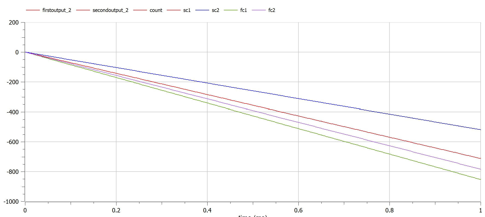
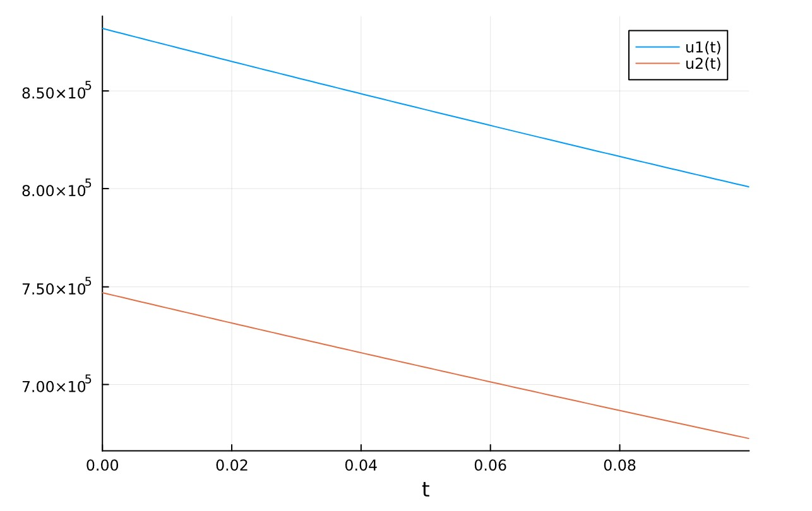

---
## Front matter
lang: ru-RU
title: Математическое моделирование
subtitle: Презентация к лабораторной работе № 3
author:
  - .
institute:
  - Российский университет дружбы народов, Москва, Россия
date: 18/02/2023

## i18n babel
babel-lang: russian
babel-otherlangs: english

## Formatting pdf
toc: false
toc-title: Содержание
slide_level: 2
aspectratio: 169
section-titles: true
theme: metropolis
header-includes:
 - \metroset{progressbar=frametitle,sectionpage=progressbar,numbering=fraction}
 - '\makeatletter'
 - '\beamer@ignorenonframefalse'
 - '\makeatother'
---

# Информация

## Докладчик

:::::::::::::: {.columns align=center}
::: {.column width="70%"}

  * 
  * Студент
  * 
  * Российский университет дружбы народов
  * 
  * 

:::
::: {.column width="30%"}

:::
::::::::::::::

## Объект и предмет исследования

- Модель боевых действий

- редактор соединений openmodelica

- блокнот jupyter и язык программирования julia

## Цели и задачи

- Решить проблему и узнать о моделах боевых действий – модели Ланчестера.

- Узнать о языке modelica и редакторе соединений openmodelica.

- Вариант 38
    
начальный момент времени страна Х имеет армию численностью 882.000 человек, а в распоряжении страны У армия численностью в 747.000 человек. Для упрощения модели считаем, что коэффициенты a b c h , , , постоянны. Также считаем P(t) и Q(t) непрерывные функции. Постройте графики изменения численности войск армии Х и армии У для
следующих случаев:
- Модель боевых действий между регулярными войсками
$$\frac{dx}{dt}=-0,4x(t)-0,67y(t)+sin(3t)+1$$
$$\frac{dy}{dt}=-0,77x(t)-0,14y(t)+cos(2t)+2$$
- Модель ведение боевых действий с участием регулярных     войск и партизанских отрядов
$$\frac{dx}{dt}=-0,24x(t)-0,67y(t)+|sin(2t)|$$
$$\frac{dy}{dt}=-0,47x(t)-0,14y(t)+|cos(2t)|$$

      
{#fig:000}

{#fig:000}

## Материалы и методы

- julia
  - julia console
- jupyter notebook
  - jupyter notebook ide for julia
- LaTex 
- openmodelica   
- Процессор **pandoc** для входного формата Markdown    
- Результирующие форматы    
	- **pdf**    
	- **docx**     
- Автоматизация процесса создания: **Makefile**       

## Результаты

- Создан отчет для лабораторной работы
- Создана презентация для лабораторной работы
- решена задача математического моделирования

## Итог работы

- Получено **pdf**      
- Получено **docx**     
