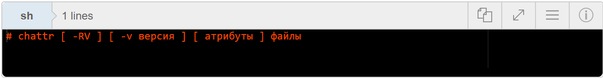
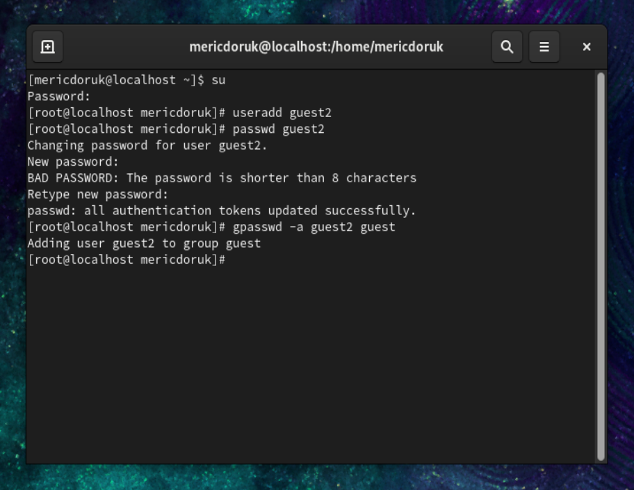
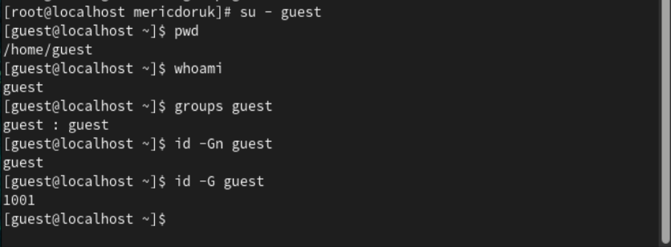
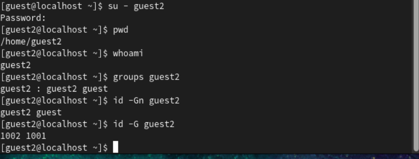
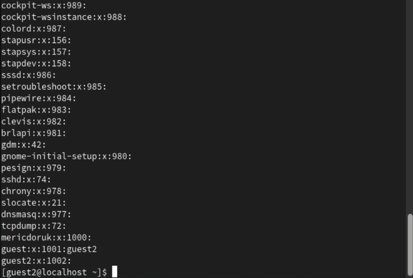
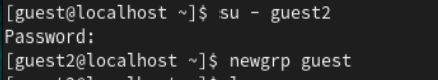
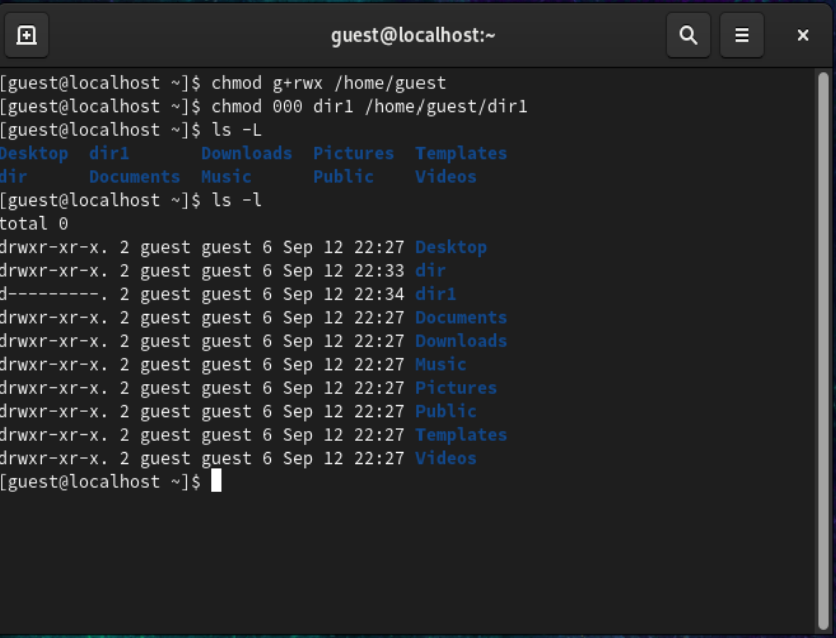
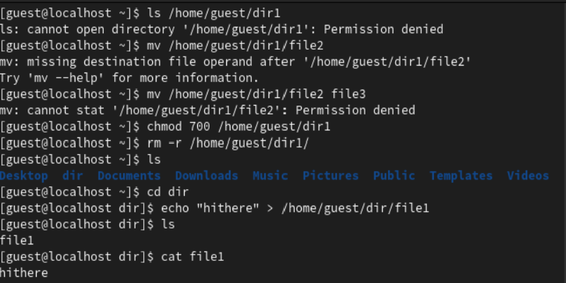
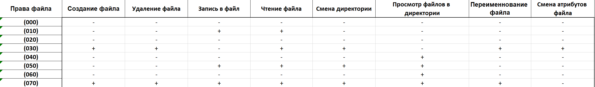
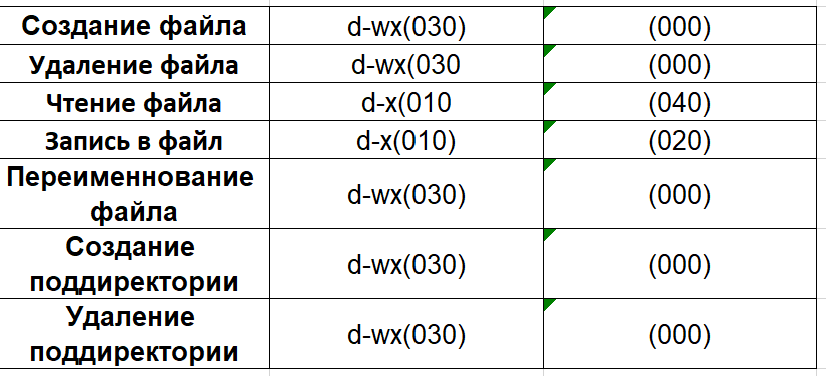

---
## Front matter
title: "Шаблон отчёта по лабораторной работе"
subtitle: "Лабораторная работа № 3"
author: "Мерич Дорук Каймакджыоглу"

## Generic otions
lang: ru-RU
toc-title: "Содержание"

## Bibliography
bibliography: bib/cite.bib
csl: pandoc/csl/gost-r-7-0-5-2008-numeric.csl

## Pdf output format
toc: true # Table of contents
toc-depth: 2
lof: true # List of figures
lot: true # List of tables
fontsize: 12pt
linestretch: 1.5
papersize: a4
documentclass: scrreprt
## I18n polyglossia
polyglossia-lang:
  name: russian
polyglossia-otherlangs:
  name: english
## I18n babel
babel-lang: russian
babel-otherlangs: english
## Fonts
mainfont: PT Serif
romanfont: PT Serif
sansfont: PT Sans
monofont: PT Mono
mainfontoptions: Ligatures=TeX
romanfontoptions: Ligatures=TeX
sansfontoptions: Ligatures=TeX,Scale=MatchLowercase
monofontoptions: Scale=MatchLowercase,Scale=0.9
## Biblatex
biblatex: true
biblio-style: "gost-numeric"
biblatexoptions:
  - parentracker=true
  - backend=biber
  - hyperref=auto
  - language=auto
  - autolang=other*
  - citestyle=gost-numeric
## Pandoc-crossref LaTeX customization
figureTitle: "Рис."
tableTitle: "Таблица"
listingTitle: "Листинг"
lofTitle: "Список иллюстраций"
lotTitle: "Список таблиц"
lolTitle: "Листинги"
## Misc options
indent: true
header-includes:
  - \usepackage{indentfirst}
  - \usepackage{float} # keep figures where there are in the text
  - \floatplacement{figure}{H} # keep figures where there are in the text
---

# Цель работы

Получение практических навыков работы в консоли с атрибутами файлов для групп пользователей.

# Задание

Дискреционное разграничение прав в Linux. Два пользователя

# Теоретическое введение
{#fig:000 width=70%}
У каждого файла имеется определённый набор свойств в файловой системе. Например, это права доступа, владелец, имя, метки времени. В Linux каждый файл имеет довольно много свойств, например, права доступа устанавливаются трижды (для владельца, группы и всех прочих), метки времени также бывают трёх разных видов (время создание, доступа и изменения). 

# Выполнение лабораторной работы

1. В установленной операционной системе создайте учётную запись пользователя guest (использую учётную запись администратора),Задайте пароль для пользователя guest (использую учётную запись администратора), аналогично создайте второго пользователя guest2, добавьте пользователя guest2 в группу guest.
{#fig:001 width=70%}

2. Осуществите вход в систему от двух пользователей на двух разных консолях, Для обоих пользователей командой pwd определите директорию, в которой вы находитесь. Сравните её с приглашениями командной строки. guest на первой консоли и guest2 на второй консоли, Уточните имя вашего пользователя, его группу, кто входит в неё и к каким группам принадлежит он сам. Определите командами groups guest и groups guest2, в какие группы входят пользовате-
ли guest и guest2. Сравните вывод команды groups с выводом команд id -Gn и id -G.
{#fig:002 width=70%}
{#fig:003 width=70%}

3. Сравните полученную информацию с содержимым файла /etc/group. Просмотрите файл командой cat /etc/group, От имени пользователя guest2 выполните регистрацию пользователя guest2 в группе guest командой newgrp guest.
{#fig:004 width=70%}
{#fig:005 width=70%}

4. От имени пользователя guest измените права директории /home/guest,
разрешив все действия для пользователей группы: chmod g+rwx /home/guest, От имени пользователя guest снимите с директории /home/guest/dir1 все атрибуты командой chmod 000 dirl.
{#fig:006 width=70%}

5. и проверьте правильность снятия атрибутов. Меняя атрибуты у директории dir1 и файла file1 от имени пользова- теля guest и делая проверку от пользователя guest2, заполните табл. 3.1, определив опытным путём, какие операции разрешены, а какие нет. Ес- ли операция разрешена, занесите в таблицу знак «+», если не разрешена, знак «-». Сравните табл. 2.1 (из лабораторной работы № 2) и табл. 3.1. На основании заполненной таблицы определите те или иные минимально необходимые права для выполнения пользователем guest2 операций внутри директории dir1 и заполните табл. 3.2
{#fig:007 width=70%}
{#fig:008 width=70%}
{#fig:009 width=70%}

# Выводы

Узнал об атрибуте файловой системы в среде linux/unix на многоуровневой пользовательской базе.

# Список литературы{.unnumbered}

[labarotory work 3](https://esystem.rudn.ru/pluginfile.php/2090204/mod_resource/content/4/003-lab_discret_2users.pdf) {#refs:labarotory work 3}
[Attribute of files in linux](https://zalinux.ru/?p=6440) {#refs:Attribute of files in linux}