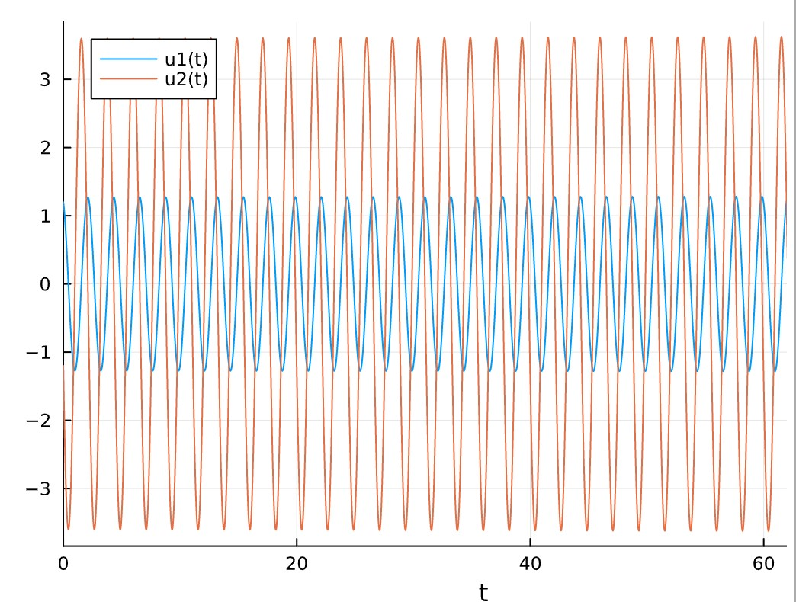
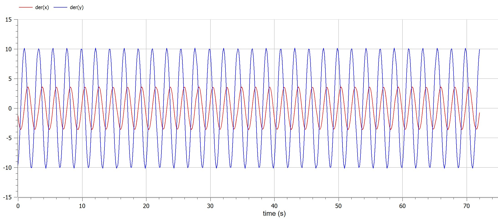
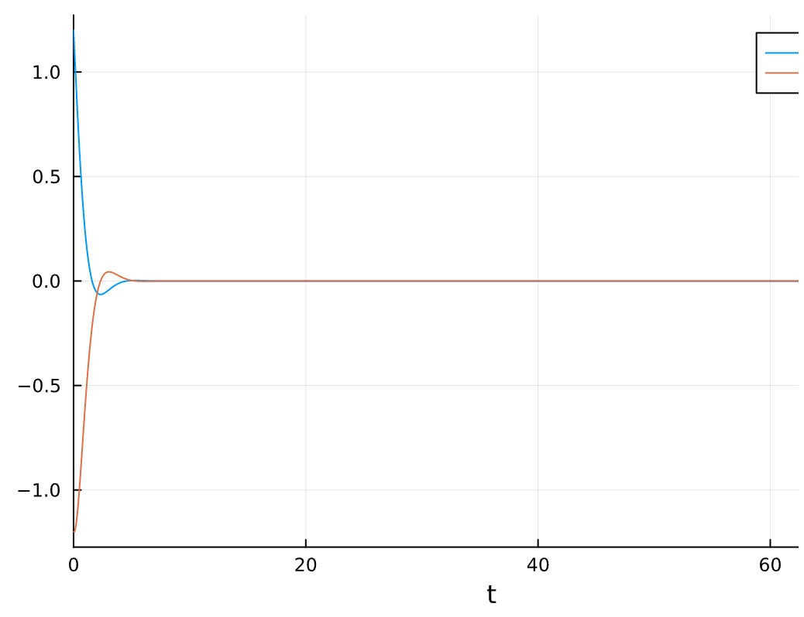
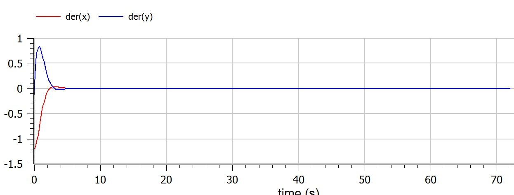
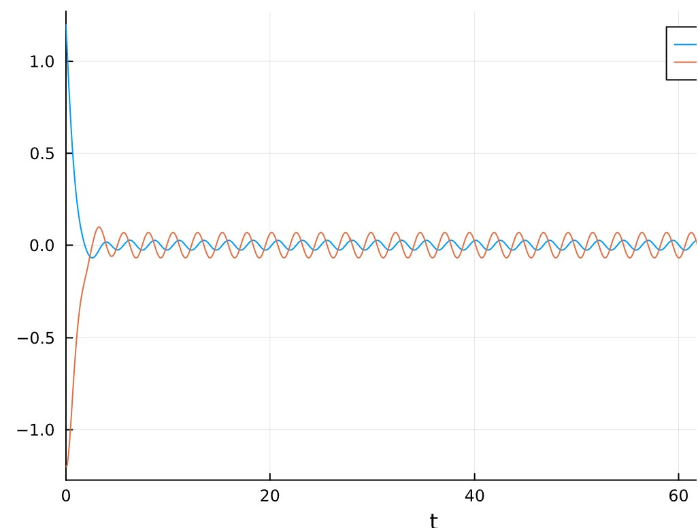
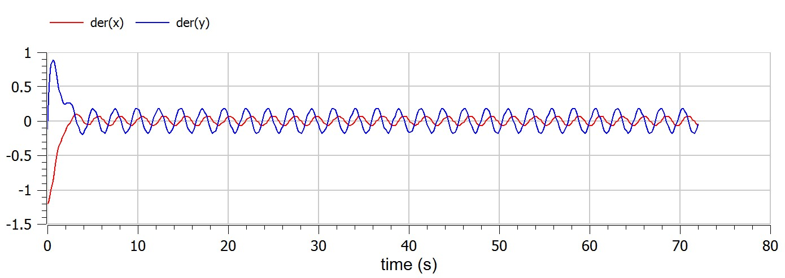

---
## Front matter
lang: ru-RU
title: Математическое моделирование
subtitle: Презентация к лабораторной работе № 4
author:
  - .
institute:
  - Российский университет дружбы народов, Москва, Россия
date: 04/03/2023

## i18n babel
babel-lang: russian
babel-otherlangs: english

## Formatting pdf
toc: false
toc-title: Содержание
slide_level: 2
aspectratio: 169
section-titles: true
theme: metropolis
header-includes:
 - \metroset{progressbar=frametitle,sectionpage=progressbar,numbering=fraction}
 - '\makeatletter'
 - '\beamer@ignorenonframefalse'
 - '\makeatother'
---

# Информация

## Докладчик

:::::::::::::: {.columns align=center}
::: {.column width="70%"}

  * 
  * Студент
  * 
  * Российский университет дружбы народов
  * 
  * 

:::
::: {.column width="30%"}

:::
::::::::::::::

## предмет исследования

- Фазовый портрет колебательной системы

## Цели и задачи

Построить фазовый портрет гармонического осциллятора и решение уравнения гармонического осциллятора для данных случаев.

- Вариант 38
    
Постройте фазовый портрет гармонического осциллятора и решение уравнения
гармонического осциллятора для следующих случаев:

* Колебания гармонического осциллятора без затуханий и без действий внешней силы $$\dot x + 21x = 0$$

полученные графики

  * julia

  {pic#001::juliafirstcase}

  * openmodelica

  {pic#002::modelicafirstcase}

* Колебания гармонического осциллятора c затуханием и без действий внешней
силы $$\ddot x + 2.2 \dot x + 2.3x = 0$$   

полученные графики

  * julia

  {pic#003::juliasecondcase}

  * openmodelica

  {pic#004::modelicasecondcase}

* Колебания гармонического осциллятора c затуханием и под действием внешней
силы $$\ddot x + 2.4\dot x + 2.5x = 0.2sin(2.6t)$$

полученные графики

  * julia

  {pic#005::juliathirdcase}

  * openmodelica

  {pic#006::modelicathirdcase}

## Материалы и методы

- openmodelica connection editor
  - modelica language
- jupyter notebook
  - julia language 
  - packages
      
## Результаты

Построен фазовый портрет гармонического осциллятора и решение уравнения гармонического осциллятора для данных случаев.

## Итог работы

- Построен фазовый портрет гармонического осциллятора  
- получено **report.md** из pandoc
- получено **report.pdf** из pandoc
- получено **report.docx** из pandoc
- получено **presentation.md** из pandoc
- получено **presentation.pdf** из pandoc
- получено **presentation.html** из pandoc
- работа выложена на хостинге [github](https://github.com/dorukme123)
- создан CHANGELOG.md 
