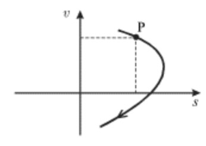
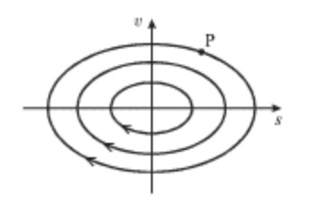
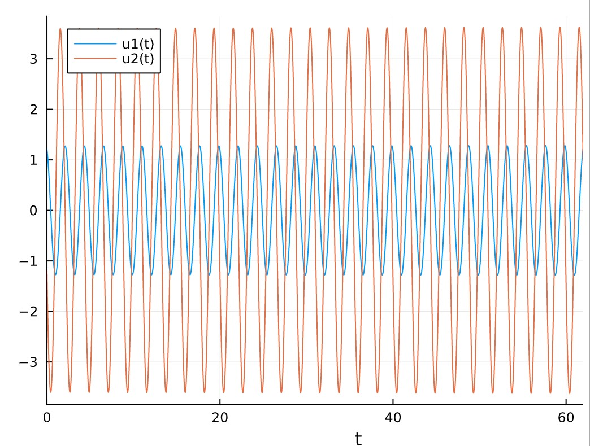
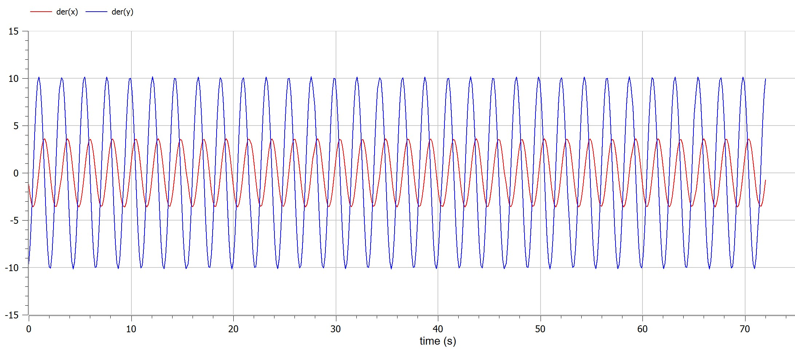
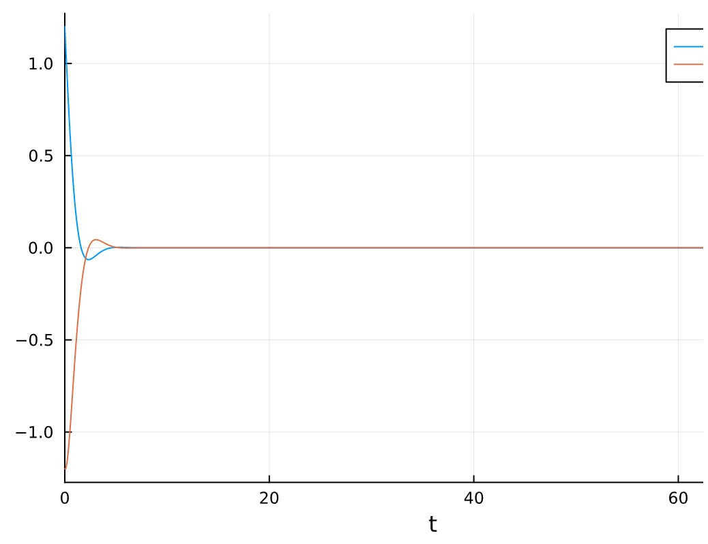
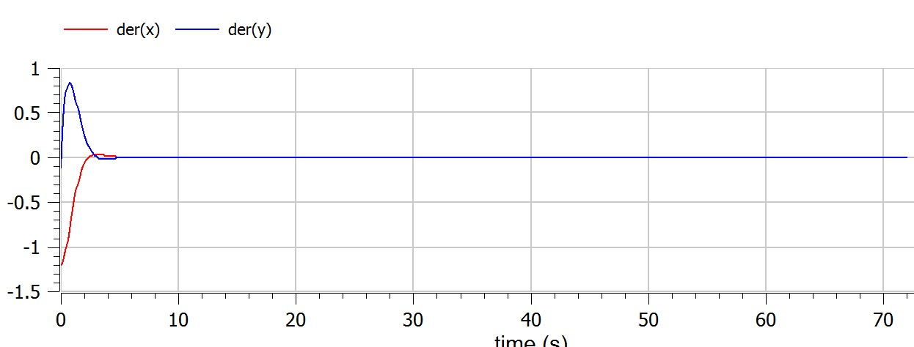
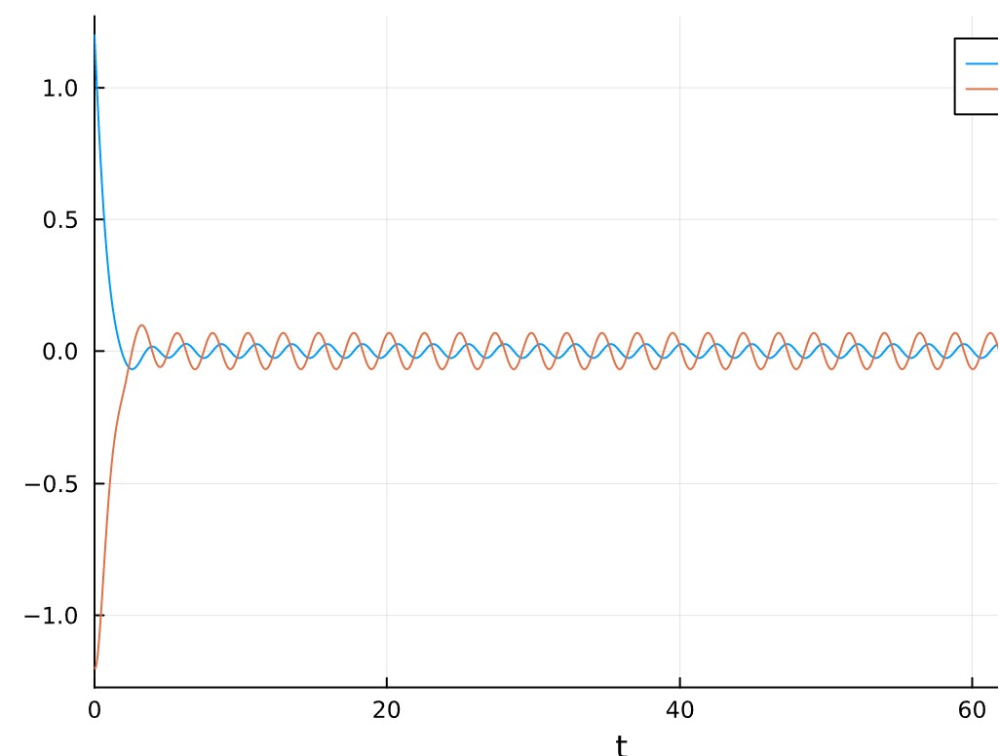
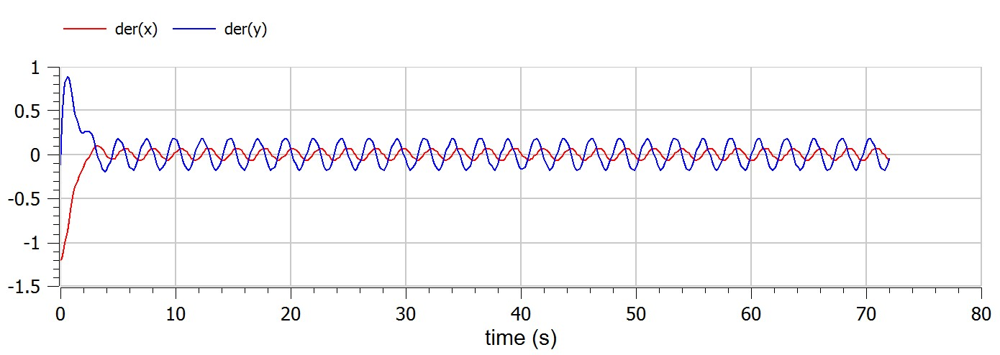

---
## Front matter
title: "Шаблон отчёта по лабораторной работе"
subtitle: ""
author: ""

## Generic otions
lang: ru-RU
toc-title: "Содержание"

## Bibliography
bibliography: bib/cite.bib
csl: pandoc/csl/gost-r-7-0-5-2008-numeric.csl

## Pdf output format
toc: true # Table of contents
toc-depth: 2
lof: true # List of figures
lot: true # List of tables
fontsize: 12pt
linestretch: 1.5
papersize: a4
documentclass: scrreprt
## I18n polyglossia
polyglossia-lang:
  name: russian
  options:
	- spelling=modern
	- babelshorthands=true
polyglossia-otherlangs:
  name: english
## I18n babel
babel-lang: russian
babel-otherlangs: english
## Fonts
mainfont: PT Serif
romanfont: PT Serif
sansfont: PT Sans
monofont: PT Mono
mainfontoptions: Ligatures=TeX
romanfontoptions: Ligatures=TeX
sansfontoptions: Ligatures=TeX,Scale=MatchLowercase
monofontoptions: Scale=MatchLowercase,Scale=0.9
## Biblatex
biblatex: true
biblio-style: "gost-numeric"
biblatexoptions:
  - parentracker=true
  - backend=biber
  - hyperref=auto
  - language=auto
  - autolang=other*
  - citestyle=gost-numeric
## Pandoc-crossref LaTeX customization
figureTitle: "Рис."
tableTitle: "Таблица"
listingTitle: "Листинг"
lofTitle: "Список иллюстраций"
lotTitle: "Список таблиц"
lolTitle: "Листинги"
## Misc options
indent: true
header-includes:
  - \usepackage{indentfirst}
  - \usepackage{float} # keep figures where there are in the text
  - \floatplacement{figure}{H} # keep figures where there are in the text
---

# Цель работы

Построить фазовый портрет гармонического осциллятора и решение уравнения гармонического осциллятора для данных случаев.

# Теоретическое введение
## Фазовый портрет колебательной системы
В любой колебательной системе с одной степенью свободы смещение s(t) и скорость v(t) = ds/dt меняются со временем. Состояние системы в каждый момент времени можно характеризовать двумя значениями $s$ и $v$, и на плоскости этих переменных это состояние однозначно определяется положением изображающей точки P с координатами $s$ и $v$. С течением времени изображающая точка P будет перемещаться по кривой, которую называют фазовой траекторией движения.



Плоскость переменных $s$ и $v$ называется фазовой плоскостью. Семейство фазовых траекторий образует фазовый портрет колебательной системы. Анализ фазового портрета дает хотя и не полную, но обширную информацию о колебательной системе. К построению такого портрета прибегают тогда, когда не удается решить аналитически уравнение, описывающее сложные колебания. В первую очередь это относится к нелинейным колебаниям, анализ которых затруднен из-за отсутствия точных решений нелинейных уравнений.

Вначале проиллюстрируем сказанное на примере простейших гармонических колебаний вида $s(t) = s_{0} \sin (\omega _{0} t + \varphi _{0} ).$

Поскольку скорость $v(t) = {\displaystyle \frac{\displaystyle {\displaystyle ds}}{\displaystyle {\displaystyle dt}}} = s_{0} \omega _{0} \sin \left( {\displaystyle \omega _{0} t + \varphi _{0} + {\displaystyle \frac{\displaystyle {\displaystyle \pi }}{\displaystyle {\displaystyle 2}}}} \right)$ опережает смещение по фазе на $\pi / 2,$ то фазовая траектория будет эллипсом. Точка P будет двигаться по эллиптической траектории по часовой стрелке (при $v \gt 0$ смещение $s$ увеличивается, а при $v \lt 0$ - уменьшается.



# Выполнение лабораторной работы
```
a = (1032204917 % 70) + 1
println("Вариант ", a)
```
- Вариант 38

Постройте фазовый портрет гармонического осциллятора и решение уравнения
гармонического осциллятора для следующих случаев:

На интервале
$$  t \in  [0;72] \quad\textrm{(шаг 0.05)}$$ 
с начальными условиями
$$ x_0=1.2 \quad y_0=-1.2$$
```m
"""julia variables"""
using Plots
using DifferentialEquations

t = (0,72)
x0 = 1.2
y0 = -1.2
u0 = [x0;y0]
```
* Колебания гармонического осциллятора без затуханий и без действий внешней
силы $$\dot x + 21x = 0$$
```m
"""julia"""
function F1(du, u, p, t)
    du[1] = u[2]
    du[2] = -8*u[1]
end
p1 = ODEProblem(F1,u0,t)
s1 = solve(p1)
plt = plot(s1)
```

{pic#001::juliafirstcase}
```m
"""modelica"""
model lab04
Real x(start=1.2);
Real y(start=-1.2);
equation
der(x) = y;
der(y) = -8*x;
end lab04;
```
{pic#002::modelicafirstcase}

* Колебания гармонического осциллятора c затуханием и без действий внешней
силы $$\ddot x + 2.2 \dot x + 2.3x = 0$$
```m
"""julia"""
function F2(du, u, p, t)
    du[1] = u[2]
    du[2] = -2.2*du[1]-2.3*u[1]
end
p2 = ODEProblem(F2,u0,t)
s2 = solve(p2)
plt = plot(s2)
```
{pic#003::juliasecondcase}
```m
"""modelica"""
model lab04
Real x(start=1.2);
Real y(start=-1.2);
equation
der(x) = y;
der(y) = -2.4*y-2.5*x;
end lab04;
```
{pic#004::modelicasecondcase}
* Колебания гармонического осциллятора c затуханием и под действием внешней
силы $$\ddot x + 2.4\dot x + 2.5x = 0.2sin(2.6t)$$
```m
"""julia"""
function F3(du, u, p, t)
    du[1] = u[2]
    du[2] = -2.4*du[1]-2.5*u[1] + 0.2*sin(2.6*t)
end
p3 = ODEProblem(F3,u0,t)
s3 = solve(p3)
plt = plot(s3)
```
{pic#005::juliathirdcase}
```m
"""modelica"""
model lab04
Real x(start=1.2);
Real y(start=-1.2);
equation
der(x) = y;
der(y) = 0.2*sin(2.6*time)-2.4*y-2.5*x;
end lab04;
```
{pic#006::modelicathirdcase}
# Выводы

Построен фазовый портрет гармонического осциллятора и решение уравнения гармонического осциллятора для данных случаев.

# Список литературы{.unnumbered}

::: [Фазовый портрет колебательной системы](http://www.astronet.ru/db/msg/1175791/page4.html) {Фазовый портрет колебательной системы}

::: [julia](https://julialang.org) {julia}

::: [openmodelica](https://openmodelica.org) {openmodelica}


