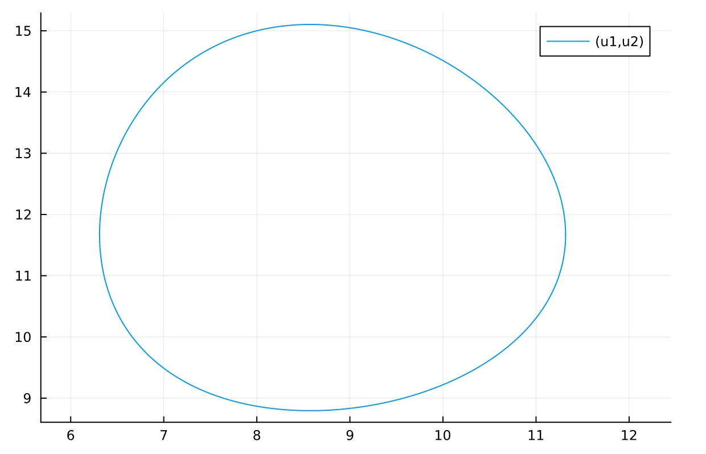
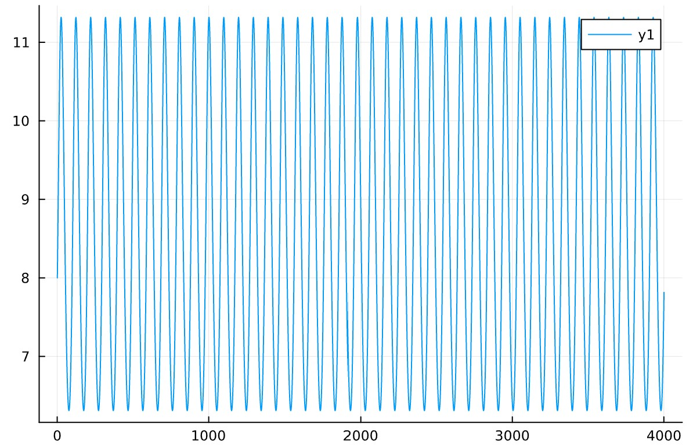
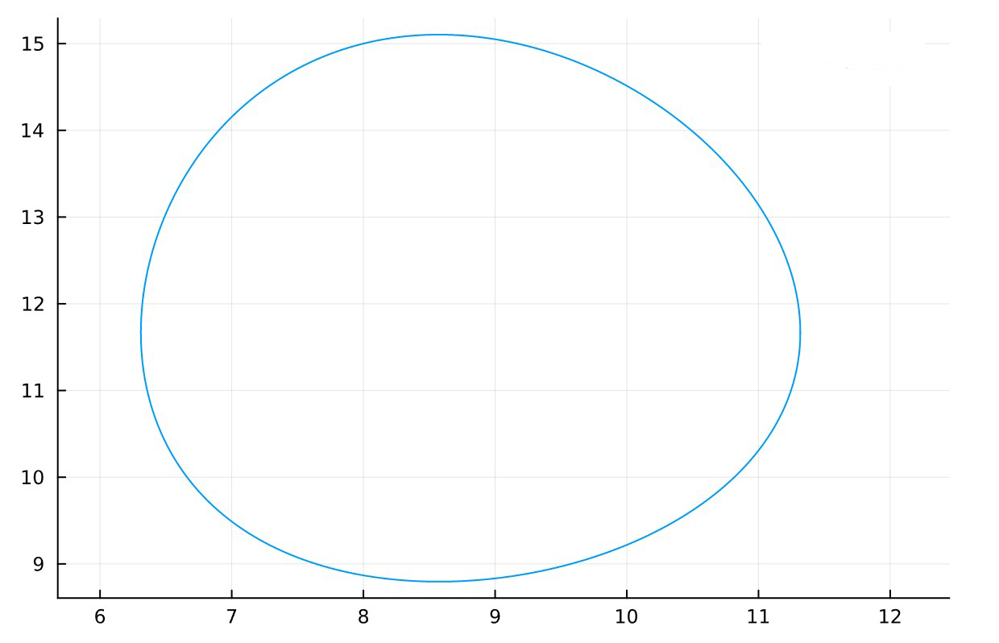
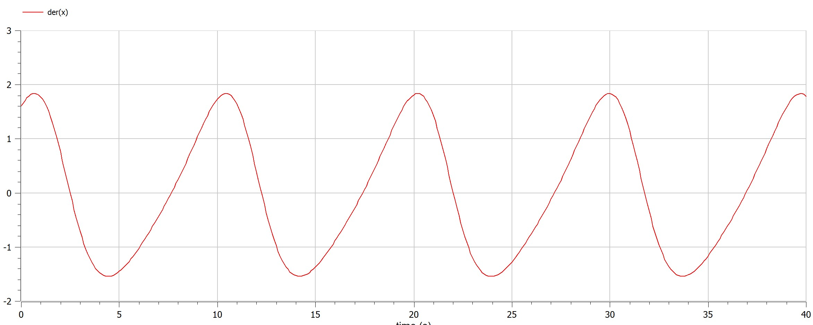
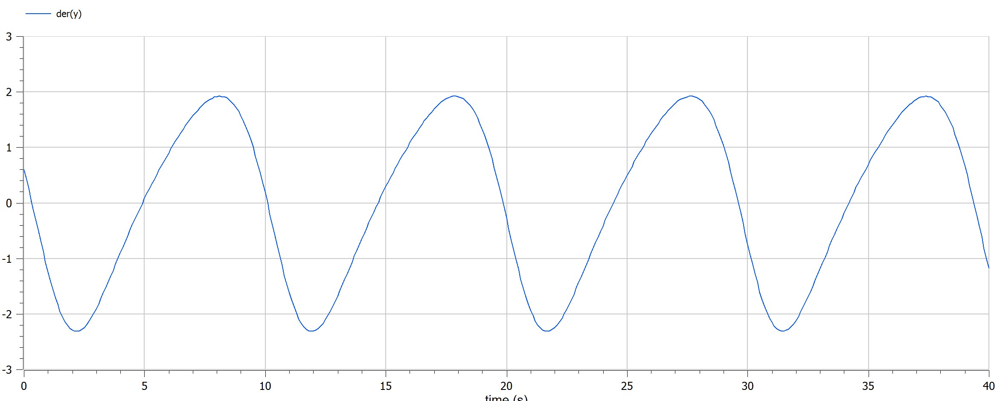

---
## Front matter
lang: ru-RU
title: Математическое моделирование
subtitle: Презентация к лабораторной работе № 5
author:
  - .
institute:
  - Российский университет дружбы народов, Москва, Россия
date: 11/03/2023

## i18n babel
babel-lang: russian
babel-otherlangs: english

## Formatting pdf
toc: false
toc-title: Содержание
slide_level: 2
aspectratio: 169
section-titles: true
theme: metropolis
header-includes:
 - \metroset{progressbar=frametitle,sectionpage=progressbar,numbering=fraction}
 - '\makeatletter'
 - '\beamer@ignorenonframefalse'
 - '\makeatother'
---

# Информация

## Докладчик

:::::::::::::: {.columns align=center}
::: {.column width="70%"}

  * 
  * Студент
  * 
  * Российский университет дружбы народов
  * 
  * 

:::
::: {.column width="30%"}

:::
::::::::::::::

## предмет исследования

## хищник жертва
* Численность популяции жертв x и хищников y зависят только от времени
(модель не учитывает пространственное распределение популяции на
занимаемой территории)
* В отсутствии взаимодействия численность видов изменяется по модели
Мальтуса, при этом число жертв увеличивается, а число хищников падает
* Естественная смертность жертвы и естественная рождаемость хищника
считаются несущественными
* Эффект насыщения численности обеих популяций не учитывается
* Скорость роста численности жертв уменьшается пропорционально
численности хищников
$$\frac{dx}{dt}=ax(t)-bx(t)y(t)$$
$$\frac{dy}{dt}=-cy(t)+dx(t)y(t)$$
В этой модели x – число жертв, y - число хищников. Коэффициент a
описывает скорость естественного прироста числа жертв в отсутствие хищников, с естественное вымирание хищников, лишенных пищи в виде жертв. Вероятность взаимодействия жертвы и хищника считается пропорциональной как количеству жертв, так и числу самих хищников (xy). Каждый акт взаимодействия уменьшает популяцию жертв, но способствует увеличению популяции хищников (члены -bxy и dxy в правой части уравнения).

## Цели и задачи

- Вариант 38

Для модели «хищник-жертва»:

$$ 
 \frac{dx}{dt} = -0.7x(t)+0.06x(t)y(t)
$$
$$ 
 \frac{dy}{dt} = 0.6y(t)-0.07x(t)y(t)
$$
Постройте график зависимости численности хищников от численности жертв,
а также графики изменения численности хищников и численности жертв при
следующих начальных условиях: $$x_0=8,y_0=15$$
Найдите стационарное
состояние системы.    

полученные графики

  * julia

  {pic#001::juliafirstcase}
  {pic#002::juliasecondcase}

  * openmodelica

  {pic#002::modelicazerocase}
  {pic#002::modelicafirstcase}
  {pic#002::modelicasecondcase}

## Материалы и методы

- openmodelica connection editor
  - modelica language
- jupyter notebook
  - julia language 
  - packages
      
## Результаты

 * Построено график зависимости численности хищников от численности жертв на julia и openmodelica
- узнал про mоделе хищник жертва

## Итог работы

- Построен mоделе хищник жертва 
- получено **report.md** из pandoc
- получено **report.pdf** из pandoc
- получено **report.docx** из pandoc
- получено **presentation.md** из pandoc
- получено **presentation.pdf** из pandoc
- получено **presentation.html** из pandoc
- работа выложена на хостинге [github](https://github.com/dorukme123)
- создан CHANGELOG.md 
