---
## Front matter
title: "Шаблон отчёта по лабораторной работе"
subtitle: "Лабораторная работа № 5"
author: "Мерич Дорук Каймакджыоглу"

## Generic otions
lang: ru-RU
toc-title: "Содержание"

## Bibliography
bibliography: bib/cite.bib
csl: pandoc/csl/gost-r-7-0-5-2008-numeric.csl

## Pdf output format
toc: true # Table of contents
toc-depth: 2
lof: true # List of figures
lot: true # List of tables
fontsize: 12pt
linestretch: 1.5
papersize: a4
documentclass: scrreprt
## I18n polyglossia
polyglossia-lang:
  name: russian
polyglossia-otherlangs:
  name: english
## I18n babel
babel-lang: russian
babel-otherlangs: english
## Fonts
mainfont: PT Serif
romanfont: PT Serif
sansfont: PT Sans
monofont: PT Mono
mainfontoptions: Ligatures=TeX
romanfontoptions: Ligatures=TeX
sansfontoptions: Ligatures=TeX,Scale=MatchLowercase
monofontoptions: Scale=MatchLowercase,Scale=0.9
## Biblatex
biblatex: true
biblio-style: "gost-numeric"
biblatexoptions:
  - parentracker=true
  - backend=biber
  - hyperref=auto
  - language=auto
  - autolang=other*
  - citestyle=gost-numeric
## Pandoc-crossref LaTeX customization
figureTitle: "Рис."
tableTitle: "Таблица"
listingTitle: "Листинг"
lofTitle: "Список иллюстраций"
lotTitle: "Список таблиц"
lolTitle: "Листинги"
## Misc options
indent: true
header-includes:
  - \usepackage{indentfirst}
  - \usepackage{float} # keep figures where there are in the text
  - \floatplacement{figure}{H} # keep figures where there are in the text
---

# Цель работы

Изучение механизмов изменения идентификаторов, применения SetUID- и Sticky-битов. Получение практических навыков работы в консоли с дополнительными атрибутами. Рассмотрение работы механизма смены идентификатора процессов пользователей, а также влияние бита Sticky на запись и удаление файлов.

# Теоретическое введение
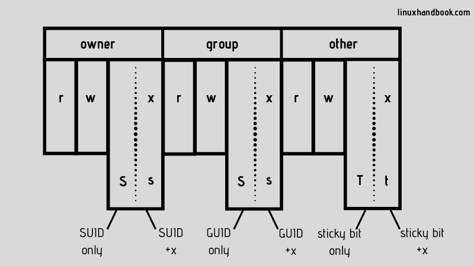{#fig:000 width=70%}
В вычислительной технике sticky-бит - это флаг права доступа пользователя, который может быть присвоен файлам и каталогам в Unix-подобных системах. Существует два определения: одно для файлов, другое для каталогов.

# Выполнение лабораторной работы

0. Подготовка лабораторного стенда.
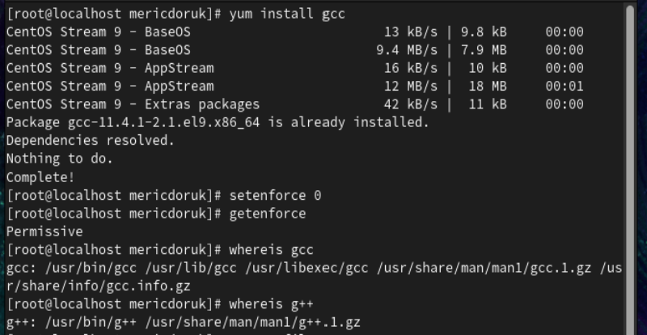{#fig:001 width=70%}
1. Войдите в систему от имени пользователя guest.
2. cоздайте программу simpleid.c:
3. Скомплилируйте программу и убедитесь, что файл программы создан:
4. Выполните программу simpleid:
5. Выполните системную программу id: и сравните полученный вами результат с данными предыдущего пункта задания.
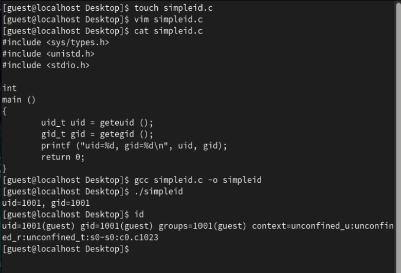{#fig:002 width=70%}
6. Усложните программу, добавив вывод действительных идентификаторов:
7. Скомпилируйте и запустите simpleid2.c:
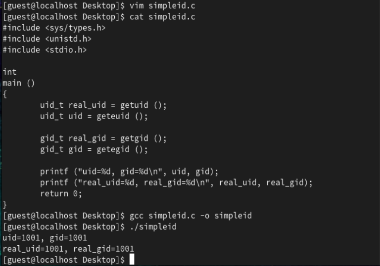{#fig:003 width=70%}
8. От имени суперпользователя выполните команды:
9. Используйте sudo или повысьте временно свои права с помощью su. Поясните, что делают эти команды.
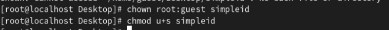{#fig:004 width=70%}
10. Выполните проверку правильности установки новых атрибутов и смены владельца файла simpleid2:
11. Запустите simpleid2 и id: Сравните результаты.
12. Проделайте тоже самое относительно SetGID-бита.
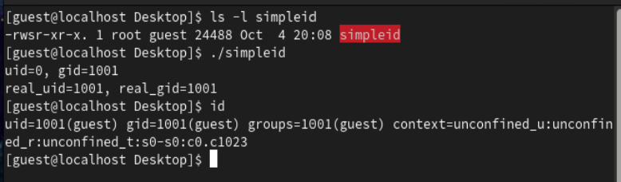{#fig:005 width=70%}
13. Создайте программу readfile.c:
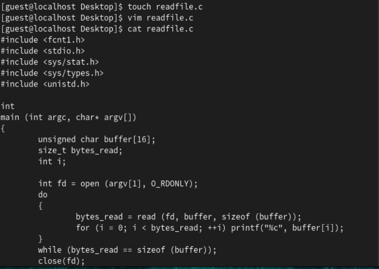{#fig:006 width=70%}
14. Откомпилируйте её.
15. Смените владельца у файла readfile.c (или любого другого текстового файла в системе) и измените права так, чтобы только суперпользователь (root) мог прочитать его, a guest не мог.
16. Проверьте, что пользователь guest не может прочитать файл readfile.c
17. Смените у программы readfile владельца и установите SetU’D-бит.
18. Проверьте, может ли программа readfile прочитать файл readfile.c?
19. Проверьте, может ли программа readfile прочитать файл /etc shadow? Отразите полученный результат и ваши объяснения в отчёте.
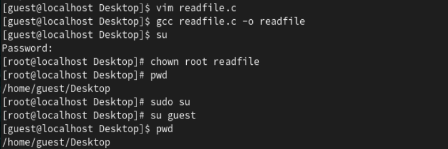{#fig:007 width=70%}

0. Исследование Sticky-бита.
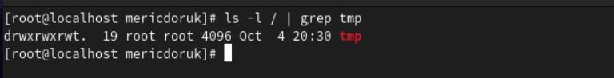{#fig:008 width=70%}
1. Выясните, установлен ли атрибут Sticky на директории /tmp, для чего выполните команду.
2. Oт имени пользователя guest создайте файл file01.txt в директории /tmp со словом test:
3. Просмотрите атрибуты у только что созданного файла и разрешите чтение и запись для категории пользователей «все остальные»:
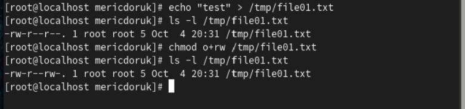{#fig:009 width=70%}
4. т пользователя guest2 (не являющегося владельцем) попробуйте прочитать файл /tmp/file01.txt:
5. От пользователя guest2 попробуйте дозаписать в файл /tmp/file01.txt слово test2 командой.
6. Проверьте содержимое файла командой.
7. От пользователя guest2 попробуйте записать в файл /tmp/file01.txt слово test3, стерев при этом всю имеющуюся в файле информацию командой:
8. Проверьте содержимое файла командой.
9. От пользователя guest2 попробуйте удалить файл /tmp/file01.txt командой.
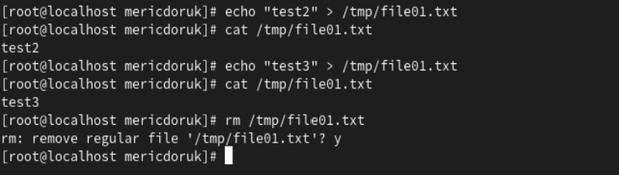{#fig:010 width=70%}
10. Повысьте свои права до суперпользователя следующей командой
su и выполните после этого команду, снимающую атрибут Sticky-бит с директории /tmp:
11. Покиньте режим суперпользователя командой.
12. От пользователя guest2 проверьте, что атрибута t у директории /tmp нет: 
15. Повысьте свои права до суперпользователя и верните атрибут t на директорию /tmp:
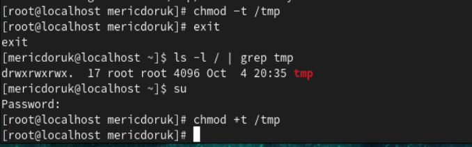{#fig:011 width=70%} 

# Выводы

Я учил механизмы изменения идентификаторов SetUID- и Sticky-битов. Посмотрел работу механизма смены идентификатора процессов пользователей также
влияние бита Sticky на запись и удаление файлов.

# Список литературы{.unnumbered}

[Лабораторная работа № 5](https://esystem.rudn.ru/pluginfile.php/2090208/mod_resource/content/2/005-lab_discret_sticky.pdf) {#refs:Лабораторная работа № 5}