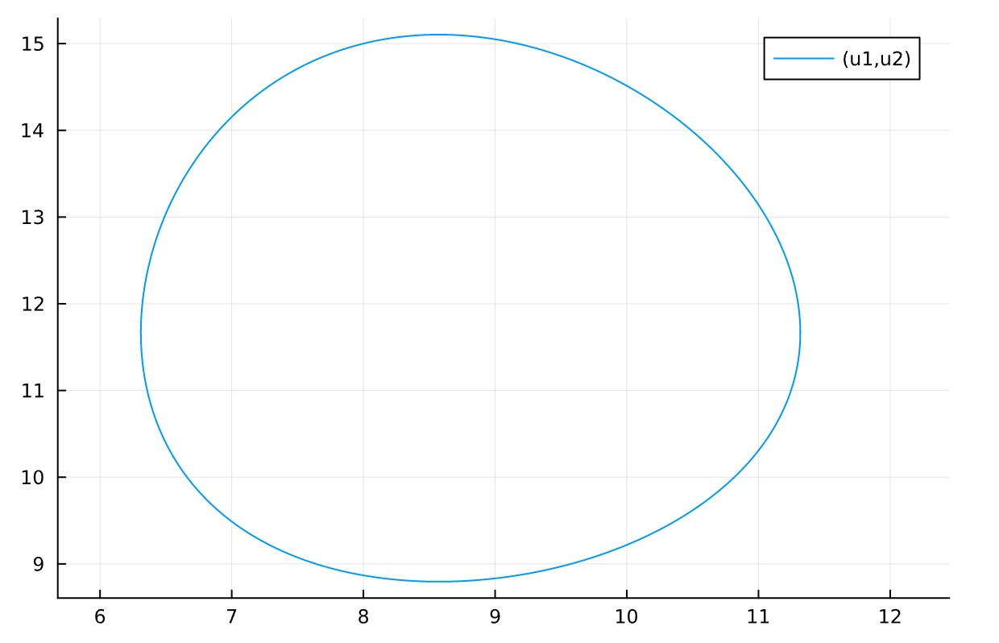
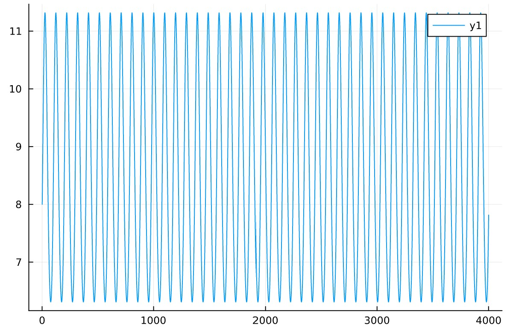
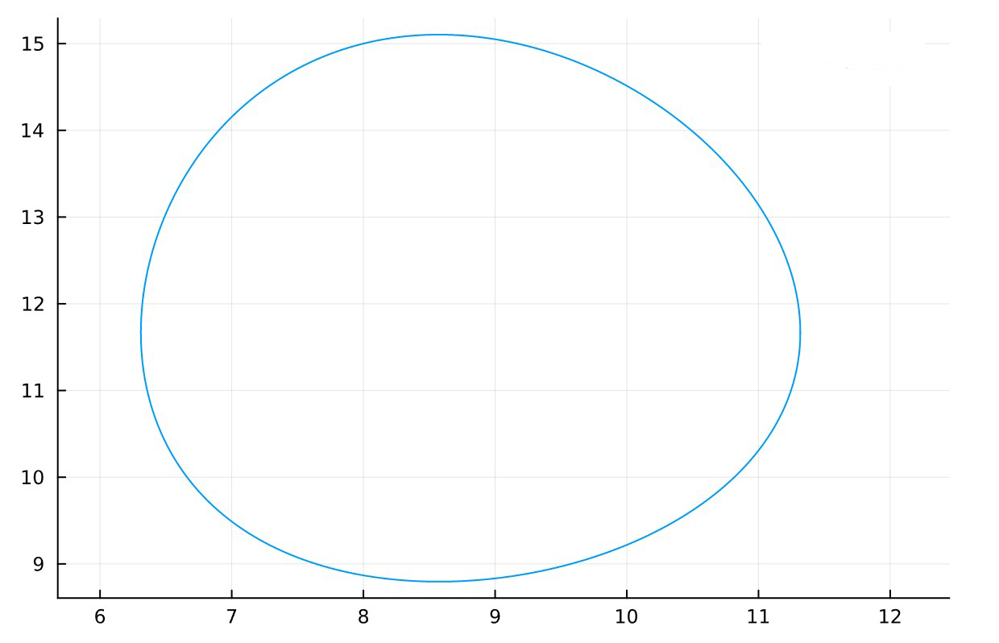
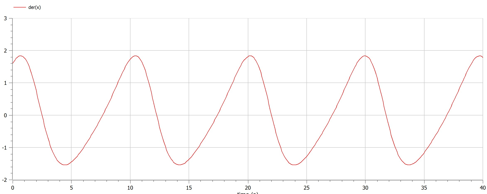
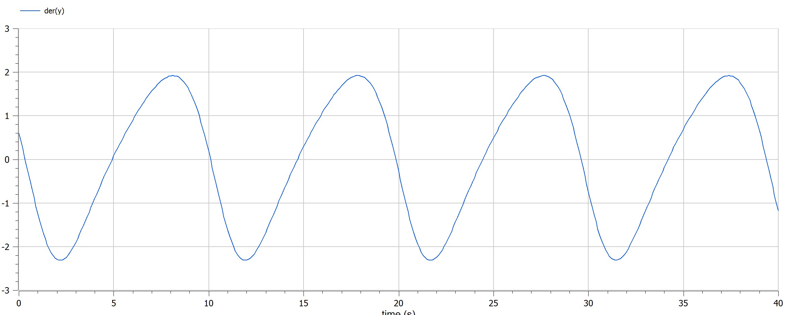

---
## Front matter
title: "Шаблон отчёта по лабораторной работе"
subtitle: "Лабораторная работа № 5"
author: ""

## Generic otions
lang: ru-RU
toc-title: "Содержание"

## Bibliography
bibliography: bib/cite.bib
csl: pandoc/csl/gost-r-7-0-5-2008-numeric.csl

## Pdf output format
toc: true # Table of contents
toc-depth: 2
lof: true # List of figures
lot: true # List of tables
fontsize: 12pt
linestretch: 1.5
papersize: a4
documentclass: scrreprt
## I18n polyglossia
polyglossia-lang:
  name: russian
polyglossia-otherlangs:
  name: english
## I18n babel
babel-lang: russian
babel-otherlangs: english
## Fonts
mainfont: PT Serif
romanfont: PT Serif
sansfont: PT Sans
monofont: PT Mono
mainfontoptions: Ligatures=TeX
romanfontoptions: Ligatures=TeX
sansfontoptions: Ligatures=TeX,Scale=MatchLowercase
monofontoptions: Scale=MatchLowercase,Scale=0.9
## Biblatex
biblatex: true
biblio-style: "gost-numeric"
biblatexoptions:
  - parentracker=true
  - backend=biber
  - hyperref=auto
  - language=auto
  - autolang=other*
  - citestyle=gost-numeric
## Pandoc-crossref LaTeX customization
figureTitle: "Рис."
tableTitle: "Таблица"
listingTitle: "Листинг"
lofTitle: "Список иллюстраций"
lotTitle: "Список таблиц"
lolTitle: "Листинги"
## Misc options
indent: true
header-includes:
  - \usepackage{indentfirst}
  - \usepackage{float} # keep figures where there are in the text
  - \floatplacement{figure}{H} # keep figures where there are in the text
---

# Цель работы

Построить график зависимости численности хищников от численности жертв на julia и openmodelica

# Теоретическое введение
## хищник жертва
* Численность популяции жертв x и хищников y зависят только от времени
(модель не учитывает пространственное распределение популяции на
занимаемой территории)
* В отсутствии взаимодействия численность видов изменяется по модели
Мальтуса, при этом число жертв увеличивается, а число хищников падает
* Естественная смертность жертвы и естественная рождаемость хищника
считаются несущественными
* Эффект насыщения численности обеих популяций не учитывается
* Скорость роста численности жертв уменьшается пропорционально
численности хищников
$$\frac{dx}{dt}=ax(t)-bx(t)y(t)$$
$$\frac{dy}{dt}=-cy(t)+dx(t)y(t)$$
В этой модели x – число жертв, y - число хищников. Коэффициент a
описывает скорость естественного прироста числа жертв в отсутствие хищников, с естественное вымирание хищников, лишенных пищи в виде жертв. Вероятность взаимодействия жертвы и хищника считается пропорциональной как количеству жертв, так и числу самих хищников (xy). Каждый акт взаимодействия уменьшает популяцию жертв, но способствует увеличению популяции хищников (члены -bxy и dxy в правой части уравнения).

**Задача:**

В лесу проживают х число волков, питающихся зайцами, число которых в
этом же лесу у. Пока число зайцев достаточно велико, для прокормки всех волков,
численность волков растет до тех пор, пока не наступит момент, что корма
перестанет хватать на всех. Тогда волки начнут умирать, и их численность будет
уменьшаться. В этом случае в какой-то момент времени численность зайцев снова
начнет увеличиваться, что повлечет за собой новый рост популяции волков. Такой
цикл будет повторяться, пока обе популяции будут существовать. Помимо этого,
на численность стаи влияют болезни и старение. Данная модель описывается
следующим уравнением:
$$\frac{dx}{dt}=ax(t)-bx(t)y(t)$$
$$\frac{dy}{dt}=-cy(t)+dx(t)y(t)$$
a, d - коэффициенты смертности

b, c - коэффициенты прироста популяции


# Выполнение лабораторной работы
```m
a = (1032204917 % 70) + 1
println("Вариант ", a)
```
- Вариант 38

Для модели «хищник-жертва»:

$$ 
 \frac{dx}{dt} = -0.7x(t)+0.06x(t)y(t)
$$
$$ 
 \frac{dy}{dt} = 0.6y(t)-0.07x(t)y(t)
$$
Постройте график зависимости численности хищников от численности жертв,
а также графики изменения численности хищников и численности жертв при
следующих начальных условиях: $$x_0=8,y_0=15$$
Найдите стационарное
состояние системы.

```python
"""julia"""
using Plots
using DifferentialEquations

x0 = 8
y0 = 15
u0 = [x0, y0]
t0 = 0
tmax = 400
a = 0.7
b = 0.06
c = 0.6
d = 0.07
tdil = (t0, tmax)
function func1(dy, y, p, t)
    dy[1] = -a*y[1]+b*y[1]*y[2]
    dy[2] = c*y[2]-d*y[1]*y[2] 
end

p1 = ODEProblem(func1, u0, tdil)
s1 = solve(p1, dtmax=0.1)

plt = plot(s1[1,:])
plt2 = plot(s1[2,:])
plt3 = plot(s1, vars=(1,2))
```

{pic#001::juliafirstcase}
{pic#002::juliasecondcase}
```m
"""modelica"""
model lab05
Real x(start=8);
Real y(start=15);
equation
der(x) = -0.7*x+0.06*x*y; 
der(y) = 0.6*y-0.07*x*y;
end lab05;
```
{pic#002::modelicazerocase}
{pic#002::modelicafirstcase}
{pic#002::modelicasecondcase}

# Выводы

 * Построено график зависимости численности хищников от численности жертв на julia и openmodelica
- узнал про иоделе хищник жертва

# Список литературы{.unnumbered}

::: [хищник жертва](https://ru.wikipedia.org/wiki/Система_«хищник_—_жертва»#:~:text=Система%20«хищник%20—%20жертва»%20—%20сложная%20экосистема%2C%20для%20которой,циклически%2C%20являясь%20иллюстрацией%20нейтрального%20равновесия.) {хищник жертва}

::: [julia](https://julialang.org) {julia}

::: [openmodelica](https://openmodelica.org) {openmodelica}


