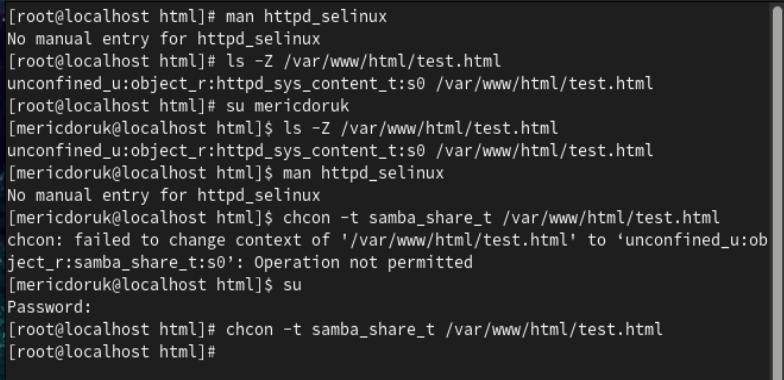
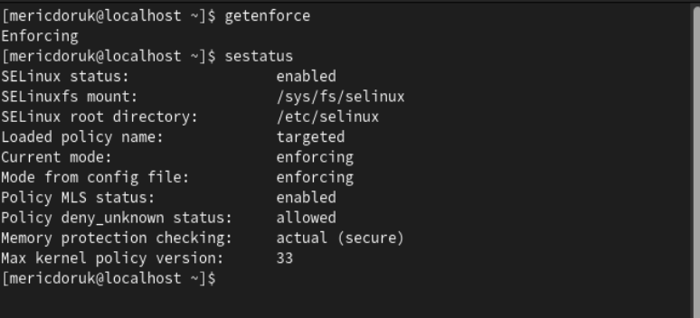
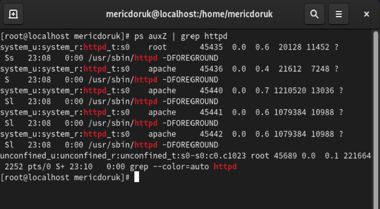

---
## Front matter
lang: ru-RU
title: Информационная безопасность
subtitle: Презентация к лабораторной работе № 6
author:
  - Мерич Дорук Каймакджыоглу.
institute:
  - Российский университет дружбы народов, Москва, Россия
date: 14/10/2023

## i18n babel
babel-lang: russian
babel-otherlangs: english

## Formatting pdf
toc: false
toc-title: Содержание
slide_level: 2
aspectratio: 169
section-titles: true
theme: metropolis
header-includes:
 - \metroset{progressbar=frametitle,sectionpage=progressbar,numbering=fraction}
 - '\makeatletter'
 - '\beamer@ignorenonframefalse'
 - '\makeatother'
---

# Информация

## Докладчик

:::::::::::::: {.columns align=center}
::: {.column width="70%"}

  * Мерич Дорук Каймакджыоглу
  * Студент
  * НКНбд-01-20
  * Российский университет дружбы народов
  * 1032204917
  * <https://github.com/dorukme123>

:::
::: {.column width="30%"}

:::
::::::::::::::

## Актуальность

Лабораторная работа № 6. Мандатное разграничение прав в Linux
{#fig:000 width=70%}

## Объект и предмет исследования

- выполнил действия, показанные в отчете.
{#fig:001 width=70%}

## Цели и задачи

Развить навыки администрирования ОС Linux. Получить первое практическое знакомство с технологией SELinux1. Проверить работу SELinx на практике совместно с веб-сервером Apache   
{#fig:002 width=70%}

## Материалы и методы

- LaTex    
- Процессор **pandoc** для входного формата Markdown    
- Результирующие форматы    
	- **pdf**    
	- **docx**     
- Автоматизация процесса создания: **Makefile**       

## Результаты

я изучил методы работы с сервером apache в среде Linux и познакомился с основами информационной безопасности
  

## Итог работы

- Получено **pdf**  из report.md   
- Получено **docx**  из report.md   
- Получено **html** из presentation.md
- Получено **pdf** из presentation.md
- Получено **docx** из presentation.md
- Запись отчета выложен в youtube.com
- Запись презентация выложен в youtube.com
- Запись отчета выложен в rutube.com
- Запись презентация выложен в rutube.com
- Работа выложена в респоситории в github.com
- CHANGELOG.md создано
- Версия на работе создано  