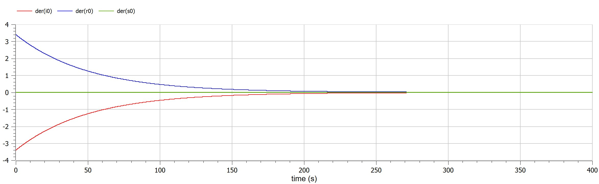

---
## Front matter
lang: ru-RU
title: Математическое моделирование
subtitle: Презентация к лабораторной работе № 6
author:
  - .
institute:
  - Российский университет дружбы народов, Москва, Россия
date: 18/03/2023

## i18n babel
babel-lang: russian
babel-otherlangs: english

## Formatting pdf
toc: false
toc-title: Содержание
slide_level: 2
aspectratio: 169
section-titles: true
theme: metropolis
header-includes:
 - \metroset{progressbar=frametitle,sectionpage=progressbar,numbering=fraction}
 - '\makeatletter'
 - '\beamer@ignorenonframefalse'
 - '\makeatother'
---

# Информация
## Докладчик

:::::::::::::: {.columns align=center}
::: {.column width="70%"}

  * 
  * Студент
  * 
  * Российский университет дружбы народов
  * 
  * 

:::
::: {.column width="30%"}

:::
::::::::::::::

## предмет исследования

простейший модель эпидемии

## Цели и задачи

- Вариант 38

На одном острове вспыхнула эпидемия. Известно, что из всех проживающих на острове (N=12 700) в момент начала эпидемии (t=0) число заболевших людей (являющихся распространителями инфекции) I(0)=170, А число здоровых людей с иммунитетом к болезни R(0)=57. Таким образом, число людей восприимчивых к болезни, но пока здоровых, в начальный момент времени S(0)=N-I(0)- R(0). Постройте графики изменения числа особей в каждой из трех групп. Рассмотрите, как будет протекать эпидемия в случае: 

* если I(0)<=I`

полученные графики

  * julia

  {pic#001::juliafirstcase}
  

  * openmodelica

  {pic#002::modelicazerocase}
  
* если I(0)>I`

полученные графики

  * julia

  {pic#001::juliafirstcase}
  

  * openmodelica

  {pic#002::modelicazerocase}

## Материалы и методы

- openmodelica connection editor
  - modelica language
- jupyter notebook
  - julia language 
  - packages
      
## Результаты

Рассмотрен простейшую модель эпидемии. Построен граф эпидемии и изучил его.

## Итог работы

- Построен простейшую модель эпидемии 
- получено **report.md** из pandoc
- получено **report.pdf** из pandoc
- получено **report.docx** из pandoc
- получено **presentation.md** из pandoc
- получено **presentation.pdf** из pandoc
- получено **presentation.html** из pandoc
- работа выложена на хостинге [github](https://github.com/dorukme123)
- создан CHANGELOG.md 
