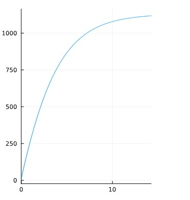
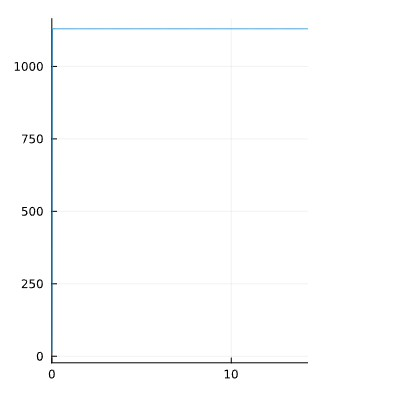
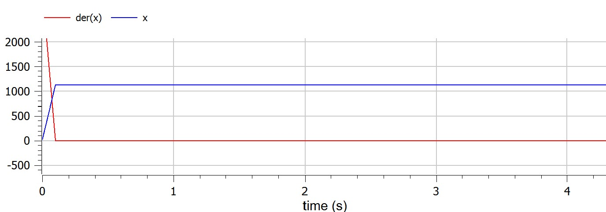
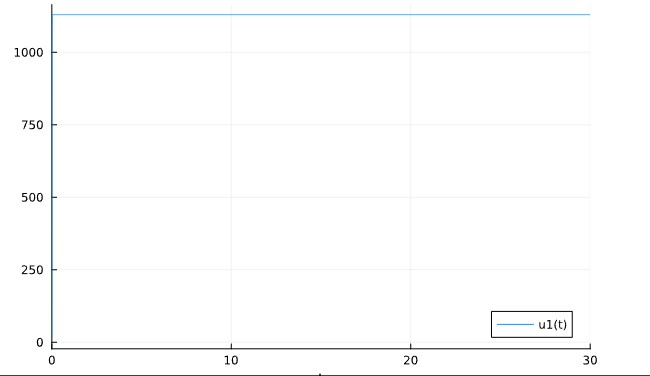
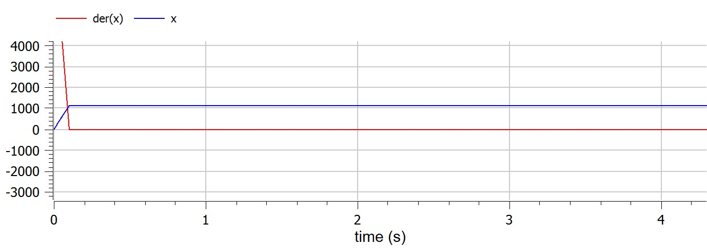

---
## Front matter
lang: ru-RU
title: Математическое моделирование
subtitle: Презентация к лабораторной работе № 7
author:
  - .
institute:
  - Российский университет дружбы народов, Москва, Россия
date: 25/03/2023

## i18n babel
babel-lang: russian
babel-otherlangs: english

## Formatting pdf
toc: false
toc-title: Содержание
slide_level: 2
aspectratio: 169
section-titles: true
theme: metropolis
header-includes:
 - \metroset{progressbar=frametitle,sectionpage=progressbar,numbering=fraction}
 - '\makeatletter'
 - '\beamer@ignorenonframefalse'
 - '\makeatother'
---

# Информация
## Докладчик

:::::::::::::: {.columns align=center}
::: {.column width="70%"}

  * 
  * Студент
  * 
  * Российский университет дружбы народов
  * 
  * 

:::
::: {.column width="30%"}

:::
::::::::::::::

## предмет исследования

- Эффективность рекламы

изучение эффективности рекламы, как она моделируется математически и как мы можем создать рабочую модель.

## Цели и задачи

- Вариант 38

Постройте график распространения рекламы, математическая модель которой описывается следующим уравнением:

- $$\frac{dn}{dt}=(0.25+0.000075n(t))(N-n(t))$$
- $$\frac{dn}{dt}=(0.000075+0.25n(t))(N-n(t))$$
- $$\frac{dn}{dt}=(0.25sin(t)+0.75n(t))(N-n(t))$$

При этом объем аудитории **N = 1130** , в начальный момент о товаре знает **11** человек. Для случая 2 определите в какой момент времени скорость распространения рекламы будет иметь максимальное значение.

1. $$\frac{dn}{dt}=(0.25+0.000075n(t))(N-n(t))$$

полученные графики

  * julia

  {pic#001::juliafirstcase}
  

  * openmodelica

  {pic#002::modelicazerocase}
  
2. $$\frac{dn}{dt}=(0.000075+0.25n(t))(N-n(t))$$

полученные графики

  * julia

  {pic#003::juliasecondcase}
  

  * openmodelica

  {pic#004::modelicasecondcase}

3. $$\frac{dn}{dt}=(0.25sin(t)+0.75n(t))(N-n(t))$$

полученные графики

  * julia

  {pic#005::juliathirdcase}
  

  * openmodelica

  {pic#006::modelicathirdcase}

## Материалы и методы

- openmodelica connection editor
  - modelica language
- jupyter notebook
  - julia language 
  - packages
      
## Результаты

узнал об эффективности рекламы, о том, как она моделируется математически и как мы можем создать рабочую модель.

## Итог работы

- Построен простейшую модель эпидемии 
- получено **report.md** из pandoc
- получено **report.pdf** из pandoc
- получено **report.docx** из pandoc
- получено **presentation.md** из pandoc
- получено **presentation.pdf** из pandoc
- получено **presentation.html** из pandoc
- работа выложена на хостинге [github](https://github.com/dorukme123)
- создан CHANGELOG.md 
