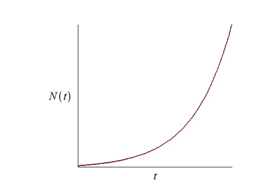
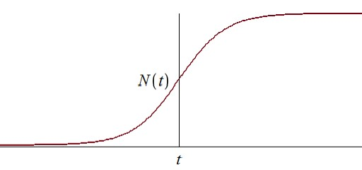
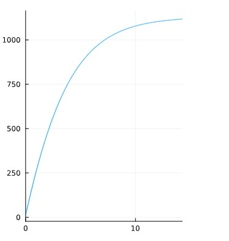
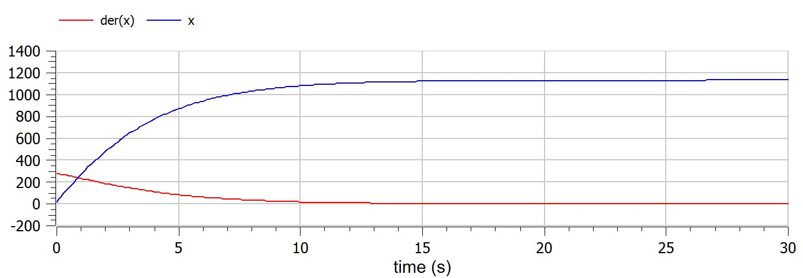
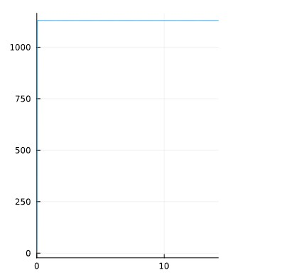
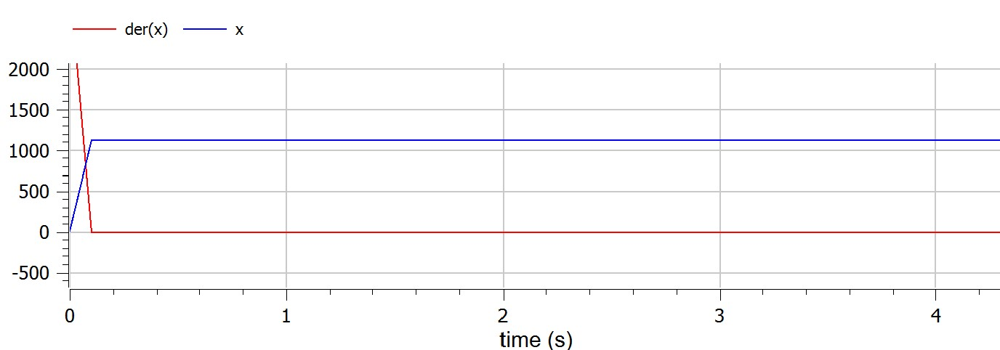
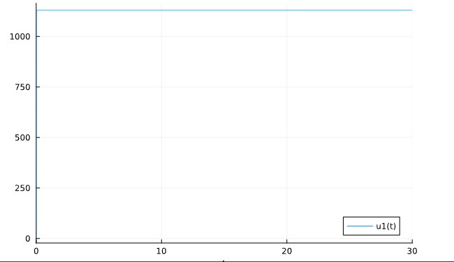
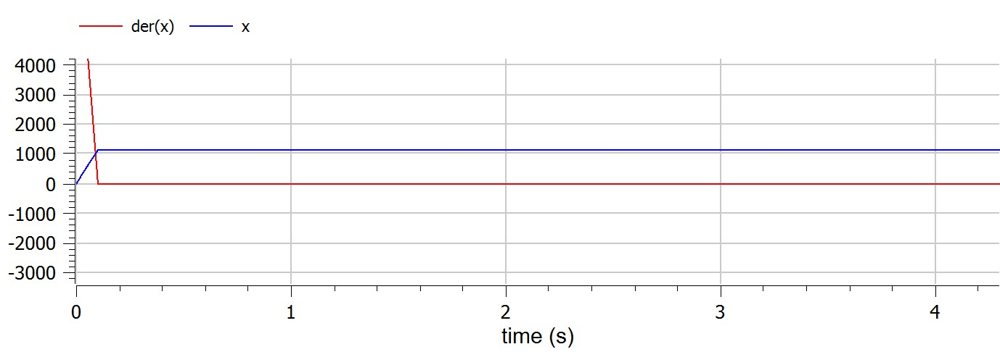

---
## Front matter
title: "Шаблон отчёта по лабораторной работе"
subtitle: "Лабораторная работа № 7"
author: ""

## Generic otions
lang: ru-RU
toc-title: "Содержание"

## Bibliography
bibliography: bib/cite.bib
csl: pandoc/csl/gost-r-7-0-5-2008-numeric.csl

## Pdf output format
toc: true # Table of contents
toc-depth: 2
lof: true # List of figures
lot: true # List of tables
fontsize: 12pt
linestretch: 1.5
papersize: a4
documentclass: scrreprt
## I18n polyglossia
polyglossia-lang:
  name: russian
  options:
	- spelling=modern
	- babelshorthands=true
polyglossia-otherlangs:
  name: english
## I18n babel
babel-lang: russian
babel-otherlangs: english
## Fonts
mainfont: PT Serif
romanfont: PT Serif
sansfont: PT Sans
monofont: PT Mono
mainfontoptions: Ligatures=TeX
romanfontoptions: Ligatures=TeX
sansfontoptions: Ligatures=TeX,Scale=MatchLowercase
monofontoptions: Scale=MatchLowercase,Scale=0.9
## Biblatex
biblatex: true
biblio-style: "gost-numeric"
biblatexoptions:
  - parentracker=true
  - backend=biber
  - hyperref=auto
  - language=auto
  - autolang=other*
  - citestyle=gost-numeric
## Pandoc-crossref LaTeX customization
figureTitle: "Рис."
tableTitle: "Таблица"
listingTitle: "Листинг"
lofTitle: "Список иллюстраций"
lotTitle: "Список таблиц"
lolTitle: "Листинги"
## Misc options
indent: true
header-includes:
  - \usepackage{indentfirst}
  - \usepackage{float} # keep figures where there are in the text
  - \floatplacement{figure}{H} # keep figures where there are in the text
---

# Цель работы

изучение эффективности рекламы, как она моделируется математически и как мы можем создать рабочую модель.

# Теоретическое введение
## Эффективность рекламы
Организуется рекламная кампания нового товара или услуги. Необходимо,
чтобы прибыль будущих продаж с избытком покрывала издержки на рекламу.
Вначале расходы могут превышать прибыль, поскольку лишь малая часть
потенциальных покупателей будет информирована о новинке. Затем, при
увеличении числа продаж, возрастает и прибыль, и, наконец, наступит момент,
когда рынок насытиться, и рекламировать товар станет бесполезным.

Предположим, что торговыми учреждениями реализуется некоторая
продукция, о которой в момент времени t из числа потенциальных покупателей N знает лишь n покупателей. Для ускорения сбыта продукции запускается реклама
по радио, телевидению и других средств массовой информации. После запуска
рекламной кампании информация о продукции начнет распространяться среди
потенциальных покупателей путем общения друг с другом. Таким образом, после
запуска рекламных объявлений скорость изменения числа знающих о продукции
людей пропорциональна как числу знающих о товаре покупателей, так и числу
покупателей о нем не знающих

Модель рекламной кампании описывается следующими величинами. Считаем, что dn/dt - скорость изменения со временем числа потребителей, узнавших о товаре и готовых его купить, t - время, прошедшее с начала рекламной кампании, n(t) - число уже информированных клиентов. Эта величина пропорциональна числу покупателей, еще не знающих о нем, это описывается следующим образом: a_1(t)(N-n(t)), где N - общее число потенциальных платежеспособных покупателей, a_1(t)>0 - характеризует интенсивность рекламной кампании (зависит от затрат на рекламу в данный момент времени). Помимо этого, узнавшие о товаре потребители также распространяют полученную информацию среди потенциальных покупателей, не знающих о нем (в этом случае работает т.н. сарафанное радио). Этот вклад в рекламу описывается величиной a_2(t)n(t)(N-n(t)), эта величина увеличивается с увеличением потребителей узнавших о товаре. Математическая модель распространения рекламы описывается уравнением:

$$\frac{dn}{dt}=(a_1(t)+a_2(t)n(t))(N-n(t))$$

При a_1(t) > a_2(t) получается модель типа модели Мальтуса, решение которой
имеет вид:

{theory1}

В обратном случае, при a_1(t) < a_2(t) получаем уравнение логистической
кривой:

{theory2}

# Выполнение лабораторной работы
```m
a = (1032204917 % 70) + 1
println("Вариант ", a)
```
- Вариант 38
Постройте график распространения рекламы, математическая модель которой описывается следующим уравнением:

- $$\frac{dn}{dt}=(0.25+0.000075n(t))(N-n(t))$$
- $$\frac{dn}{dt}=(0.000075+0.25n(t))(N-n(t))$$
- $$\frac{dn}{dt}=(0.25sin(t)+0.75n(t))(N-n(t))$$

При этом объем аудитории **N = 1130** , в начальный момент о товаре знает **11** человек. Для случая 2 определите в какой момент времени скорость распространения рекламы будет иметь максимальное значение.

1. $$\frac{dn}{dt}=(0.25+0.000075n(t))(N-n(t))$$

```python
"""julia"""
using Plots
using DifferentialEquations

N = 1130
x0 = 11
tmin = 0
tmax = 30
t0 = (tmin, tmax)
u0 = [x0]

function p1(dy,y,p,t)
    dy[1] = (0.25+0.000075*y[1])*(N - y[1])
end
p11 = ODEProblem(p1,u0,t0)
s1 = solve(p11,dtmax=0.1)
plot(s1)

```
{pic#001::juliafirstcase}

```m
"""modelica"""
model lab07
Integer N = 1130;
Real x(start=11);
equation
der(x) = (0.25+0.000075*x)*(N-x);
end lab07;

```
{pic#002::modelicafirstcase}

2. $$\frac{dn}{dt}=(0.000075+0.25n(t))(N-n(t))$$

```python
"""julia"""
using Plots
using DifferentialEquations

N = 1130
x0 = 11
tmin = 0
tmax = 30
t0 = (tmin, tmax)
u0 = [x0]

function p2(dy,y,p,t)   
    dy[1] = (0.000075+0.25*y[1])*(N - y[1])
end
p22 = ODEProblem(p2,u0,t0)
s2 = solve(p22,dtmax=0.1)
plot(s2)

```
{pic#002::juliasecondcase}

```m
"""modelica"""
model lab07
Integer N = 1130;
Real x(start=11);
equation
der(x) = (0.000075+0.25*x)*(N-x);
end lab07;

```
{pic#002::modelicasecondcase}

3. $$\frac{dn}{dt}=(0.25sin(t)+0.75n(t))(N-n(t))$$

```python
"""julia"""
using Plots
using DifferentialEquations

N = 1130
x0 = 11
tmin = 0
tmax = 30
t0 = (tmin, tmax)
u0 = [x0]

function p3(dy,y,p,t)   
    dy[1] = (0.25*sin(t)+0.75*y[1])*(N - y[1])
end
p33 = ODEProblem(p3,u0,t0)
s3 = solve(p33,dtmax=0.1)
plot(s3)

```
{pic#002::juliathirdcase}

```m
"""modelica"""
model lab07
Integer N = 1130;
Real x(start=11);
equation
der(x) = (0.25*sin(time)+0.75*x)*(N-x);
end lab07;
```
{pic#002::modelicathirdcase}

# Выводы

узнал об эффективности рекламы, о том, как она моделируется математически и как мы можем создать рабочую модель.

# Список литературы{3}

::: [Эффективность рекламы](https://ru.wikipedia.org/wiki/Эффективность_рекламы#:~:text=Эффективность%20рекламы%20—%20это%20то%2C%20в,затратам%2C%20которые%20вызвали%20данный%20эффект.) {Эффективность рекламы}

::: [julia](https://julialang.org) {julia}

::: [openmodelica](https://openmodelica.org) {openmodelica}


