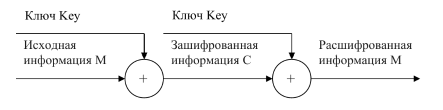
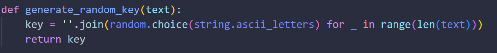
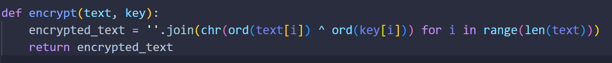
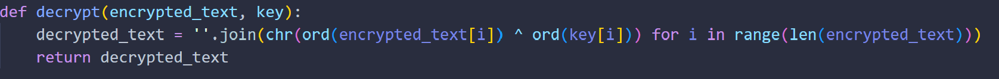
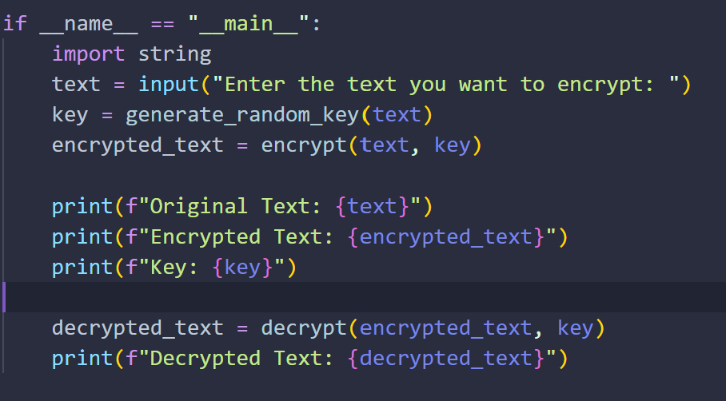
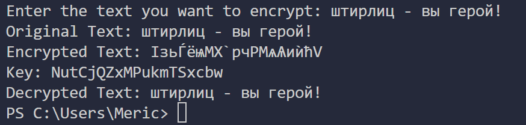
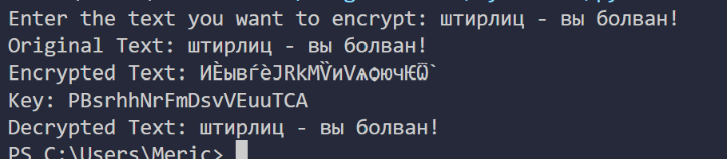

---
## Front matter
title: "Шаблон отчёта по лабораторной работе"
subtitle: "Лабораторная работа № 7"
author: "Мерич Дорук Каймакджыоглу"

## Generic otions
lang: ru-RU
toc-title: "Содержание"

## Bibliography
bibliography: bib/cite.bib
csl: pandoc/csl/gost-r-7-0-5-2008-numeric.csl

## Pdf output format
toc: true # Table of contents
toc-depth: 2
lof: true # List of figures
lot: true # List of tables
fontsize: 12pt
linestretch: 1.5
papersize: a4
documentclass: scrreprt
## I18n polyglossia
polyglossia-lang:
  name: russian
polyglossia-otherlangs:
  name: english
## I18n babel
babel-lang: russian
babel-otherlangs: english
## Fonts
mainfont: PT Serif
romanfont: PT Serif
sansfont: PT Sans
monofont: PT Mono
mainfontoptions: Ligatures=TeX
romanfontoptions: Ligatures=TeX
sansfontoptions: Ligatures=TeX,Scale=MatchLowercase
monofontoptions: Scale=MatchLowercase,Scale=0.9
## Biblatex
biblatex: true
biblio-style: "gost-numeric"
biblatexoptions:
  - parentracker=true
  - backend=biber
  - hyperref=auto
  - language=auto
  - autolang=other*
  - citestyle=gost-numeric
## Pandoc-crossref LaTeX customization
figureTitle: "Рис."
tableTitle: "Таблица"
listingTitle: "Листинг"
lofTitle: "Список иллюстраций"
lotTitle: "Список таблиц"
lolTitle: "Листинги"
## Misc options
indent: true
header-includes:
  - \usepackage{indentfirst}
  - \usepackage{float} # keep figures where there are in the text
  - \floatplacement{figure}{H} # keep figures where there are in the text
---

# Цель работы

- Освоить на практике применение режима однократного гаммирования.

# Задание

Нужно подобрать ключ, чтобы получить сообщение «С Новым Годом, друзья!». Требуется разработать приложение, позволяющее шифровать и дешифровать данные в режиме однократного гаммирования. Приложение должно:
1. Определить вид шифротекста при известном ключе и известном открытом тексте.
2. Определить ключ, с помощью которого шифротекст может быть преобразован в некоторый фрагмент текста, представляющий собой один из возможных вариантов прочтения открытого текста.

# Теоретическое введение
{#fig:000 width=70%}
Предложенная Г. С. Вернамом так называемая «схема однократного использования (гаммирования)» (рис. 7.1) является простой, но надёжной схемой шифрования данных. Гаммирование представляет собой наложение (снятие) на открытые (зашифрованные) данные последовательности элементов других данных, по- лученной с помощью некоторого криптографического алгоритма, для получения зашифрованных (открытых) данных. Иными словами, наложение гаммы — это сложение её элементов с элементами открытого (закрытого) текста по некоторому фиксированному модулю, значение которого пред- ставляет собой известную часть алгоритма шифрования. В соответствии с теорией криптоанализа, если в методе шифрования используется однократная вероятностная гамма (однократное гаммирование) той же длины, что и подлежащий сокрытию текст, то текст нельзя раскрыть. Даже при раскрытии части последовательности гаммы нельзя получить информацию о всём скрываемом тексте.

# Выполнение лабораторной работы

1. `generate_random_key(text):` Эта функция генерирует случайную строку key той же длины, что и входной текст text. Каждый символ ключа выбирается случайным образом из букв английского алфавита (строчных и заглавных).
{#fig:001 width=70%}

2. `encrypt(text, key):` Эта функция выполняет шифрование текста text. Она проходит по каждому символу в text и применяет операцию XOR (^) между кодами символов в text и соответствующими символами в ключе key. Результат этой операции - это зашифрованный символ. Зашифрованные символы объединяются в строку и возвращаются как зашифрованный текст.
{#fig:002 width=70%}

3. `decrypt(encrypted_text, key):` Эта функция выполняет обратную операцию дешифрования зашифрованного текста encrypted_text. Она также применяет операцию XOR между зашифрованными символами и ключом key, что восстанавливает исходный текст. Расшифрованные символы объединяются в строку и возвращаются как исходный текст.
{#fig:003 width=70%}

4. Main функция:

  - {#fig:004 width=70%}

5. Выводи:

  - {#fig:005 width=70%}
  - {#fig:006 width=70%}

# Контрольные вопросы

1. Поясните смысл однократного гаммирования.

2. Перечислите недостатки однократного гаммирования. - это процесс применения гаммы (случайной последовательности битов) к исходному тексту путем побитового XOR (исключающее ИЛИ) каждого бита исходного текста с соответствующим битом гаммы. Это используется для шифрования данных путем применения ключа (гаммы) к открытому тексту. В результате получается зашифрованный текст. При этом важно, чтобы гамма была случайной и использовалась только один раз для шифрования данного сообщения, чтобы обеспечить безопасность шифра.

3. Перечислите преимущества однократного гаммирования.
    - Полная секретность: При правильной реализации и использовании OTP обеспечивается абсолютная секретность сообщения.

    - Ключевой материал одноразового использования: Ключ (гамма) может быть использован только один раз, что делает взлом практически невозможным.

    - Отсутствие узоров: OTP не подвержен криптоанализу на основе статистики, так как каждый бит гаммы используется только один раз.

    - Высокая стойкость к взлому: При правильной реализации, OTP остается стойким к атакам даже с использованием мощных компьютеров.

    - Не зависит от алгоритма: OTP не зависит от сложных алгоритмов, и его безопасность основана на секретности ключа.

    - Идеальная случайность ключа: Гамма должна быть абсолютно случайной, что обеспечивает высокую стойкость к взлому.

4. Почему длина открытого текста должна совпадать с длиной ключа?
    - Секретность: В OTP каждый бит ключа (гаммы) используется для шифрования соответствующего бита открытого текста путем операции XOR. Если длина ключа не совпадает с длиной открытого текста, то операция XOR будет неоднозначной, и это может утечь информацию или сделать шифр уязвимым.

    - Случайность: Ключ (гамма) должен быть абсолютно случайным и одноразовым. Если длина ключа отличается от длины открытого текста, это может привести к паттернам в шифртексте, что ухудшит секретность.

    - Комплексность атаки: Сопоставление ключа и открытого текста делает атаки гораздо сложнее, так как даже при известном открытом тексте атакующему нужно знать точный ключ для расшифровки.

5. Какая операция используется в режиме однократного гаммирования, назовите её особенности?
    - Непредсказуемость: XOR обеспечивает высокую степень непредсказуемости в шифровании. Результат операции зависит от сочетания битов открытого текста и ключа, и даже небольшое изменение в одном из них приведет к совершенно разным результатам.

    - Воспроизводимость: XOR является обратимой операцией, то есть применение ее дважды с тем же ключом вернет исходные данные. Это позволяет расшифровать шифртекст обратно в открытый текст, если ключ известен.

    - Простота: XOR - простая и быстрая операция, которая не требует сложных вычислений и является эффективной для шифрования и дешифрования.

    - Устойчивость к криптоанализу: При правильном использовании OTP и случайной гамме XOR обеспечивает высокую стойкость к криптоанализу и защиту от раскрытия информации.

6. Как по открытому тексту и ключу получить шифротекст? - Открытый текст (представлен в виде битов) и ключ (гамма, также в виде битов) должны иметь одинаковую длину. Примените операцию XOR к каждому биту открытого текста и соответствующему биту ключа. Это означает, что биты с одинаковыми позициями в открытом тексте и ключе будут объединены с использованием XOR. Результатом этой операции будет шифротекст, который также будет представлен в виде битов.
  - `1 XOR 1 = 0`
    `1 XOR 0 = 1`
    `0 XOR 1 = 1`
    `1 XOR 0 = 1`
    `1 XOR 1 = 0`
    `0 XOR 0 = 0`
    `1 XOR 1 = 0`
    `0 XOR 1 = 1`

7. Как по открытому тексту и шифротексту получить ключ? - Имейте открытый текст и соответствующий ему шифротекст. Они должны иметь одинаковую длину.Выполните операцию XOR над каждым битом открытого текста и соответствующим битом шифротекста. Это означает, что биты на одинаковых позициях в открытом тексте и шифротексте будут объединены с использованием XOR. Результатом этой операции будет ключ (гамма), который будет иметь ту же длину, что и открытый текст и шифротекст.
  - `Пусть у вас есть открытый текст: 11011010 и соответствующий шифротекст: 01110101.`

8. В чем заключаются необходимые и достаточные условия абсолютной стойкости шифра?
    - Достаточно длинные ключи: Ключи должны быть достаточно длинными и содержать достаточное количество битов, чтобы усложнить попытки атаки методами перебора ключей.

    - Абсолютно случайные ключи: Ключи должны быть абсолютно случайными, и каждый бит ключа должен быть независимым от других. Повторное использование ключа приводит к снижению стойкости.

    - Одноразовое использование ключа: Ключи должны использоваться только один раз для шифрования каждого сообщения (как в случае однократного гаммирования - OTP). Повторное использование ключа делает шифр уязвимым.

    - Неизменность ключа в процессе шифрования: Ключ не должен меняться в процессе шифрования сообщения. Если ключ меняется, это может сделать шифр уязвимым к атакам, таким как атака с известным текстом.

    - Секретность ключа: Ключи должны быть хранены и передаваться в секрете, и доступ к ним должен быть строго ограничен. Утечка ключа существенно снижает стойкость шифра.

# Выводы

- Я освоил на практике применение режима однократного гаммирования.

# Список литературы{.unnumbered}

[№ 7. Элементы криптографии. Однократное гаммирование](https://esystem.rudn.ru/pluginfile.php/2090212/mod_resource/content/2/007-lab_crypto-gamma.pdf) {#refs:Кулябов Д. С., Королькова А. В., Геворкян М. Н.}