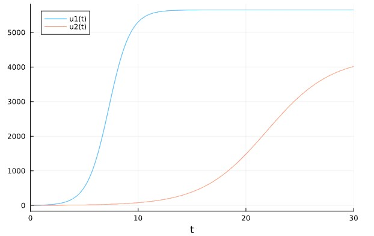
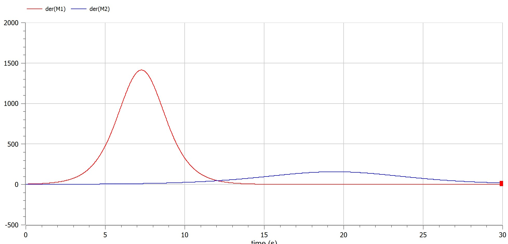
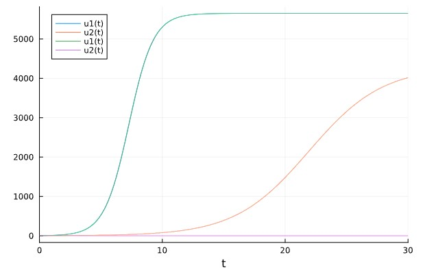
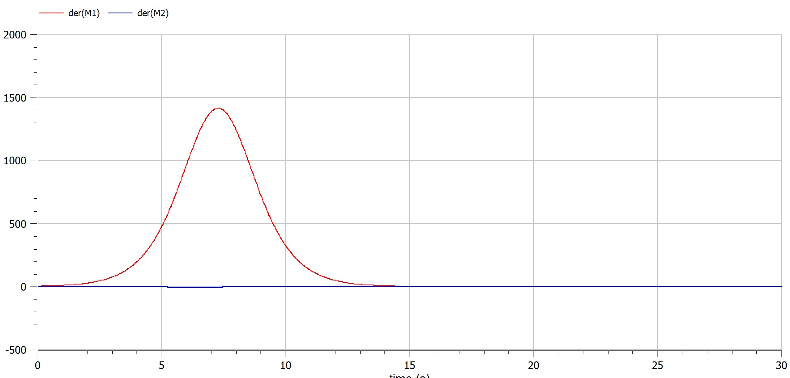

---
## Front matter
lang: ru-RU
title: Математическое моделирование
subtitle: Презентация к лабораторной работе № 8
author:
  - .
institute:
  - Российский университет дружбы народов, Москва, Россия
date: 01/04/2023

## i18n babel
babel-lang: russian
babel-otherlangs: english

## Formatting pdf
toc: false
toc-title: Содержание
slide_level: 2
aspectratio: 169
section-titles: true
theme: metropolis
header-includes:
 - \metroset{progressbar=frametitle,sectionpage=progressbar,numbering=fraction}
 - '\makeatletter'
 - '\beamer@ignorenonframefalse'
 - '\makeatother'
---

# Информация
## Докладчик

:::::::::::::: {.columns align=center}
::: {.column width="70%"}

  * 
  * Студент
  * 
  * Российский университет дружбы народов
  * 
  * 

:::
::: {.column width="30%"}

:::
::::::::::::::

## предмет исследования

### Модель конкуренции двух фирм

## Цели и задачи

- Вариант 38

Случай 1. Рассмотрим две фирмы, производящие взаимозаменяемые товары одинакового качества и находящиеся в одной рыночной нише. Считаем, что в рамках нашей модели конкурентная борьба ведётся только рыночными методами. То есть, конкуренты могут влиять на противника путем изменения параметров своего
производства: себестоимость, время цикла, но не могут прямо вмешиваться в ситуацию на рынке («назначать» цену или влиять на потребителей каким-либо иным
способом.) Будем считать, что постоянные издержки пренебрежимо малы, и в модели учитывать не будем. В этом случае динамика изменения объемов продаж фирмы 1 и фирмы 2 описывается следующей системой уравнений:

$$\frac{dM_1}{d\theta}=M_1\frac{b}{c_1}M_1 M_2 - \frac{a_1}{c_1}(M_1)^2$$

$$\frac{dM_2}{d\theta}=\frac{c_2}{c_1}M_2 -\frac{b}{c_1}M_1 M_2 - \frac{a_1}{c_1}(M_2)^2$$

$$a_1=\frac{P_c}{\tau_1^2 P_1^2 Nq},a_2=\frac{P_c}{\tau_1^2 P_1^2 Nq},b=\frac{P_c}{\tau_1^2 P_1^2 \tau_2^2 P_2^2 Nq},c_1=\frac{P_c - P_1}{\tau_1 P_1},c_2=\frac{P_c - P_2}{\tau_2 P_2}$$

введена нормировка $$t=c_1\theta$$

Случай 2. Рассмотрим модель, когда, помимо экономического фактора влияния (изменение себестоимости, производственного цикла, использование
кредита и т.п.), используются еще и социально-психологические факторы – формирование общественного предпочтения одного товара другому, не зависимо от их качества и цены. В этом случае взаимодействие двух фирм будет зависеть друг от друга, соответственно коэффициент перед M_1 M_2 будет отличаться. Пусть в рамках рассматриваемой модели динамика изменения объемов продаж фирмы 1 и фирмы 2 описывается следующей системой уравнений:

$$\frac{dM_1}{d\theta}=M_1\frac{b}{c_1}M_1 M_2 - \frac{a_1}{c_1}(M_1)^2$$

$$\frac{dM_2}{d\theta}=\frac{c_2}{c_1}M_2 -(\frac{b}{c_1}+0,00083)M_1 M_2 - \frac{a_1}{c_1}(M_2)^2$$

Для обоих случаев рассмотрим задачу со следующими начальными условиями и параметрами:
$$M_0^1=3.9,M_0^2=2.9,P_c=25,N=39,q=1,\tau_1=29,\tau_2=19,P_1=6.9,P_2=15.9$$

Обозначения:
N – число потребителей производимого продукта.
τ – длительность производственного цикла
p – рыночная цена товара
p̃– себестоимость продукта, то есть переменные издержки на производство единицы
продукции.
q – максимальная потребность одного человека в продукте в единицу времени

1. Постройте графики изменения оборотных средств фирмы 1 и фирмы 2 без
учета постоянных издержек и с веденной нормировкой для случая 1.
2. Постройте графики изменения оборотных средств фирмы 1 и фирмы 2 без
учета постоянных издержек и с веденной нормировкой для случая 2.

полученные графики

  * julia

  {pic#001::juliafirstcase}
  

  * openmodelica

  {pic#002::modelicazerocase}
  

полученные графики

  * julia

  {pic#001::juliafirstcase}
  

  * openmodelica

  {pic#002::modelicazerocase}

## Материалы и методы

- openmodelica connection editor
  - modelica language
- jupyter notebook
  - julia language 
  - packages
      
## Результаты

узнал о модели конкуренции между фирмами и смоделировал ее на компьютере

## Итог работы

- Построен Модель конкуренции двух фирм
- получено **report.md** из pandoc
- получено **report.pdf** из pandoc
- получено **report.docx** из pandoc
- получено **presentation.md** из pandoc
- получено **presentation.pdf** из pandoc
- получено **presentation.html** из pandoc
- работа выложена на хостинге [github](https://github.com/dorukme123)
- создан CHANGELOG.md 
