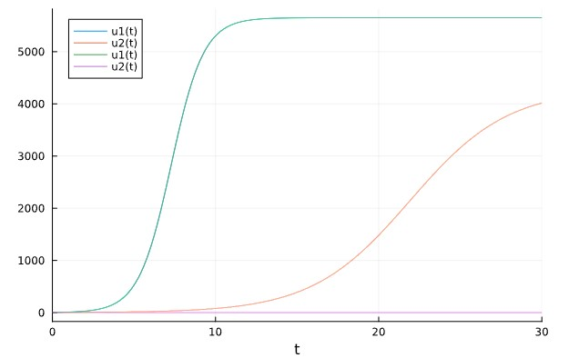
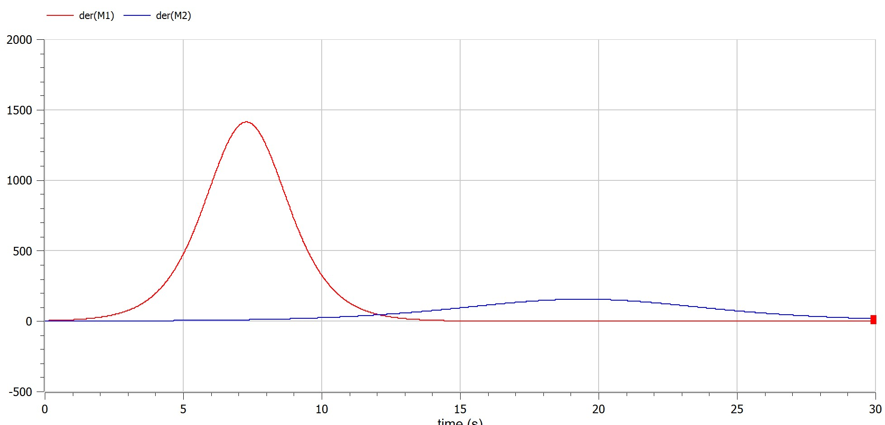
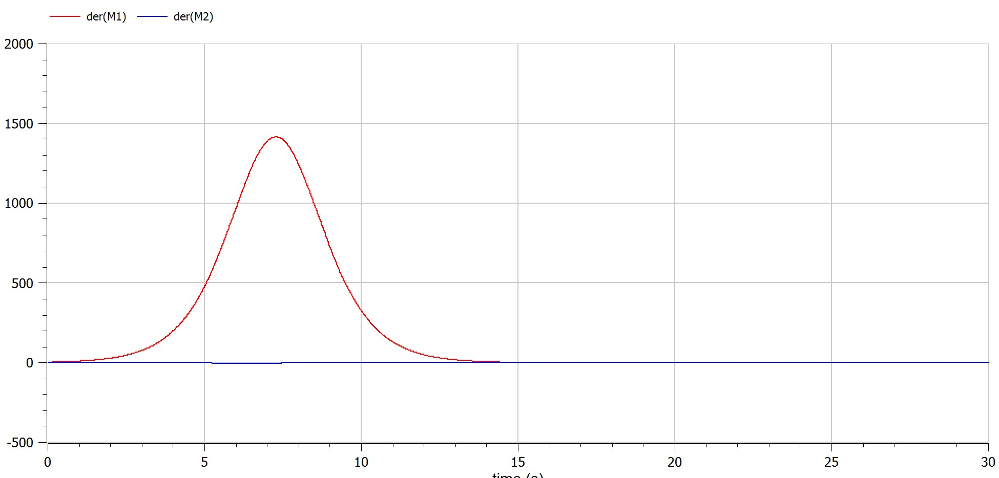

---
## Front matter
title: "Шаблон отчёта по лабораторной работе"
subtitle: "
author: "Мерич Дорук Каймакджыоглу"

## Generic otions
lang: ru-RU
toc-title: "Содержание"

## Bibliography
bibliography: bib/cite.bib
csl: pandoc/csl/gost-r-7-0-5-2008-numeric.csl

## Pdf output format
toc: true # Table of contents
toc-depth: 2
lof: true # List of figures
lot: true # List of tables
fontsize: 12pt
linestretch: 1.5
papersize: a4
documentclass: scrreprt
## I18n polyglossia
polyglossia-lang:
  name: russian
polyglossia-otherlangs:
  name: english
## I18n babel
babel-lang: russian
babel-otherlangs: english
## Fonts
mainfont: PT Serif
romanfont: PT Serif
sansfont: PT Sans
monofont: PT Mono
mainfontoptions: Ligatures=TeX
romanfontoptions: Ligatures=TeX
sansfontoptions: Ligatures=TeX,Scale=MatchLowercase
monofontoptions: Scale=MatchLowercase,Scale=0.9
## Biblatex
biblatex: true
biblio-style: "gost-numeric"
biblatexoptions:
  - parentracker=true
  - backend=biber
  - hyperref=auto
  - language=auto
  - autolang=other*
  - citestyle=gost-numeric
## Pandoc-crossref LaTeX customization
figureTitle: "Рис."
tableTitle: "Таблица"
listingTitle: "Листинг"
lofTitle: "Список иллюстраций"
lotTitle: "Список таблиц"
lolTitle: "Листинги"
## Misc options
indent: true
header-includes:
  - \usepackage{indentfirst}
  - \usepackage{float} # keep figures where there are in the text
  - \floatplacement{figure}{H} # keep figures where there are in the text
---

# Цель работы

узнать о модели конкуренции между фирмами и смоделировать ее на компьютере.

# Теоретическое введение
## Модель конкуренции двух фирм
На рынке однородного товара присутствуют две основные фирмы, разделяющие его между собой, т.е. имеет место классическая дуополия.

Безусловно, это является весьма сильным предположением, однако оно вполне оправдано в тех случаях, когда доля продаж остальных конкурентов на рассматриваемом сегменте рынке пренебрежимо мала. Хорошим примером может служить отечественный рынок микропроцессоров, который по существу разделили между собой две фирмы: Intel и AMD. 

Изменение объемов продаж конкурирующих фирм с течением времени описывается следующей системой дифференциальных уравнений:

$$\frac{dq_1(t)}{dt}=a_1q_1(t)[N-(q_1(t)+q_2(t))]-b_1q_1(t)q_2(t)$$

$$\frac{dq_2(t)}{dt}=a_2q_2(t)[N-(q_1(t)+q_2(t))]-b_2q_2(t)q_1(t)$$

с начальными условиями q1(0)=q01, q2(0)=q02  

Здесь и далее использованы следующие обозначения:

q1(t) - объем продаж фирмы I;
q2(t)-объем продаж фирмы II 

N - объем рассматриваемого сегмента рынка сбыта;

a1 , b1 , a2 , b2 -положительные коэффициенты, характеризующие степень влияния различных факторов на изменения объема продаж первой и второй фирмы соответственно.

Уравнения (1) получены из следующих самых общих соображений.

С достаточным основанием можно утверждать, что скорость изменения объемов продаж фирм со временем задается формулами:

$$\frac{dq_1(t)}{dt}=A_1-B_1$$

$$\frac{dq_2(t)}{dt}=A_2-B_2$$

где Ai  и Bij являются в общем случае функциями qi.
Задача теперь состоит в определении вида  зависимостей Ai=Ai (q) и Bij =Bij (q).  
Функция Ai (q) описывает влияние внутренней среды предприятия на рост объема продаж и может быть с учетом логистической поправки записана в виде:

$$A_i(q)=a_iq_i[N-(q_i+q_j)]$$

Заметим, что здесь учтен тот факт, что суммарный объем продаж двух фирм qi+qj не может превышать N. 

Слагаемое Bij  (q) выражает влияние внешней среды предприятия на рост объема продаж и учитывает уменьшение объема продаж i-ой фирмы за счет роста продаж j-ой: bi qi q j .

В результате подобных рассуждений удается  построить систему дифференциальных уравнений (1)-(2), которая тривиально обобщается на случай произвольного количества конкурирующих предприятий.

Для удобства дальнейшего исследования введем в рассмотрение безразмерные переменные:

τ= a1(Nt) - безразмерное время,                   

yi =qi /N  - безразмерный объем продаж i-ой фирмы (i=1,2).

После этого модель задачи приобретает вид

$$\frac{dy_1(\tau)}{d\tau}=y_1(\tau)[1-(y_1(\tau)+y_2(\tau))]-\frac{b_1}{a_1}y_1(\tau)y_2(\tau)$$

$$\frac{dy_2(\tau)}{d\tau}=\frac{a_2}{a_1}y_2(\tau)[1-(y_1(\tau)+y_2(\tau))]-\frac{b_2}{a_1}y_1(\tau)y_2(\tau)$$

Начальные условия  приобретают вид:y1(0)=y01, y2(0)=y02

Таким образом, мы приходим к задаче Коши для системы обыкновенных дифференциальных уравнений, представляющей собой основу для математического моделирования рассматриваемого процесса.

Система интегрировалась ПЭВМ для широкого диапазона параметров и начальных условий с использованием стандартного алгоритма Рунге-Кутта четвертого порядка , реализованного в среде разработки VBA для пакета MS Office 2002 XP.

Некоторые полученные результаты приведены ниже в виде графиков зависимости безразмерных объемов продаж фирм y1 и y2 от безразмерного времени τ на рис. 1-3. На всех графиках по горизонтальной оси отложена величина τ, а по вертикальной оси- y1 и y2.

Рис.1. соответствует ситуации, когда на рынке присутствует только фирма I, т.е. имеет место классическая монополия. Система в этом случае вырождается в задачу Коши для одного уравнения

$$\frac{dq_1(t)}{dt}=a_1q_1(t)[N-q_1(t)],q_1(0)=q_0$$

или в безразмерном виде

$$\frac{dy_1(\tau)}{d\tau}=y_1(\tau)[1-y_1(\tau)],y_1(0)=y_0$$

# Выполнение лабораторной работы
```m
a = (1032204917 % 70) + 1
println("Вариант ", a)
```
- Вариант 38

Случай 1. Рассмотрим две фирмы, производящие взаимозаменяемые товары одинакового качества и находящиеся в одной рыночной нише. Считаем, что в рамках нашей модели конкурентная борьба ведётся только рыночными методами. То есть, конкуренты могут влиять на противника путем изменения параметров своего
производства: себестоимость, время цикла, но не могут прямо вмешиваться в ситуацию на рынке («назначать» цену или влиять на потребителей каким-либо иным
способом.) Будем считать, что постоянные издержки пренебрежимо малы, и в модели учитывать не будем. В этом случае динамика изменения объемов продаж фирмы 1 и фирмы 2 описывается следующей системой уравнений:

$$\frac{dM_1}{d\theta}=M_1\frac{b}{c_1}M_1 M_2 - \frac{a_1}{c_1}(M_1)^2$$

$$\frac{dM_2}{d\theta}=\frac{c_2}{c_1}M_2 -\frac{b}{c_1}M_1 M_2 - \frac{a_1}{c_1}(M_2)^2$$

$$a_1=\frac{P_c}{\tau_1^2 P_1^2 Nq},a_2=\frac{P_c}{\tau_1^2 P_1^2 Nq},b=\frac{P_c}{\tau_1^2 P_1^2 \tau_2^2 P_2^2 Nq},c_1=\frac{P_c - P_1}{\tau_1 P_1},c_2=\frac{P_c - P_2}{\tau_2 P_2}$$

введена нормировка $$t=c_1\theta$$

Случай 2. Рассмотрим модель, когда, помимо экономического фактора влияния (изменение себестоимости, производственного цикла, использование
кредита и т.п.), используются еще и социально-психологические факторы – формирование общественного предпочтения одного товара другому, не зависимо от их качества и цены. В этом случае взаимодействие двух фирм будет зависеть друг от друга, соответственно коэффициент перед M_1 M_2 будет отличаться. Пусть в рамках рассматриваемой модели динамика изменения объемов продаж фирмы 1 и фирмы 2 описывается следующей системой уравнений:

$$\frac{dM_1}{d\theta}=M_1\frac{b}{c_1}M_1 M_2 - \frac{a_1}{c_1}(M_1)^2$$

$$\frac{dM_2}{d\theta}=\frac{c_2}{c_1}M_2 -(\frac{b}{c_1}+0,00083)M_1 M_2 - \frac{a_1}{c_1}(M_2)^2$$

Для обоих случаев рассмотрим задачу со следующими начальными условиями и параметрами:
$$M_0^1=3.9,M_0^2=2.9,P_c=25,N=39,q=1,\tau_1=29,\tau_2=19,P_1=6.9,P_2=15.9$$

Обозначения:
N – число потребителей производимого продукта.
τ – длительность производственного цикла
p – рыночная цена товара
p̃– себестоимость продукта, то есть переменные издержки на производство единицы
продукции.
q – максимальная потребность одного человека в продукте в единицу времени

1. Постройте графики изменения оборотных средств фирмы 1 и фирмы 2 без
учета постоянных издержек и с веденной нормировкой для случая 1.
2. Постройте графики изменения оборотных средств фирмы 1 и фирмы 2 без
учета постоянных издержек и с веденной нормировкой для случая 2.


```python
"""julia"""
using Plots
using DifferentialEquations

const M01 = 3.9
const M02 = 2.9
const p_c = 25
const N = 39
const q = 1
const tau1 = 29
const tau2 = 19
const p1 = 6.9
const p2 = 15.9
a1 = p_c/(tau1^2*p1^2*N*q)
a2 = p_c/(tau2^2*p2^2*N*q)
b = p_c/(tau1^2*tau2^2*p1^2*p2^2*N*q)
c1 = (p_c - p1)/(tau1*p1)
c2 = (p_c - p2)/(tau2*p2)
tmin = 0
tmax = 30
td = (tmin,tmax)
u0 = [M01,M02]

function func1(dy, y, p, t)
 dy[1] = y[1] - b/c1*y[1]*y[2] - a1/c1*y[1]^2
 dy[2] = c2/c1*y[2] - b/c1*y[1]*y[2] - a2/c1*y[2]^2
end

pr1 = ODEProblem(func1,u0,td)
s1 = solve(pr1,dtmax=0.01)

plot!(s1)

function func2(dy, y, p, t)
 dy[1] = y[1] - b/c1*y[1]*y[2] - a1/c1*y[1]^2
 dy[2] = c2/c1*y[2] - (b/c1+0.0083)*y[1]*y[2] - a2/c1*y[2]^2
end

pr2 = ODEProblem(func2,u0,td)
s2 = solve(pr2,dtmax=0.01)

plot!(s2)

```
Случай 1.

{pic#001::juliafirstcase}

Случай 2.

{pic#002::juliasecondcase}

```m
"""modelica"""
model lab08
constant Real M01 = 3.9;
constant Real M02 = 2.9;
constant Real p_c = 25;
constant Real N = 39;
constant Real q = 1;
constant Real tau1 = 29;
constant Real tau2 = 19;
constant Real p1 = 6.9;
constant Real p2 = 15.9;
parameter Real a1 = p_c/(tau1^2*p1^2*N*q);
parameter Real a2 = p_c/(tau2^2*p2^2*N*q);
parameter Real b = p_c/(tau1^2*tau2^2*p1^2*p2^2*N*q);
parameter Real c1 = (p_c - p1)/(tau1*p1);
parameter Real c2 = (p_c - p2)/(tau2*p2);
Real M1(start=M01);
Real M2(start=M02);
equation
der(M1) = M1 - b/c1*M1*M2 - a1/c1*M1^2;
der(M2) = c2/c1*M2 - b/c1*M1*M2 - a1/c1*M2^2;

end lab08;

```
Случай 1.

{pic#003::modelicafirstcase}

Случай 2.

{pic#003::modelicasecondcase}

# Выводы

узнал о модели конкуренции между фирмами и смоделировал ее на компьютере

# Список литературы{3}

::: [Модель конкуренции двух фирм](https://esystem.rudn.ru/pluginfile.php/1971586/mod_resource/content/2/Лабораторная%20работа%20№%207.pdf) {Модель конкуренции двух фирм}

::: [julia](https://julialang.org) {julia}

::: [openmodelica](https://openmodelica.org) {openmodelica}


